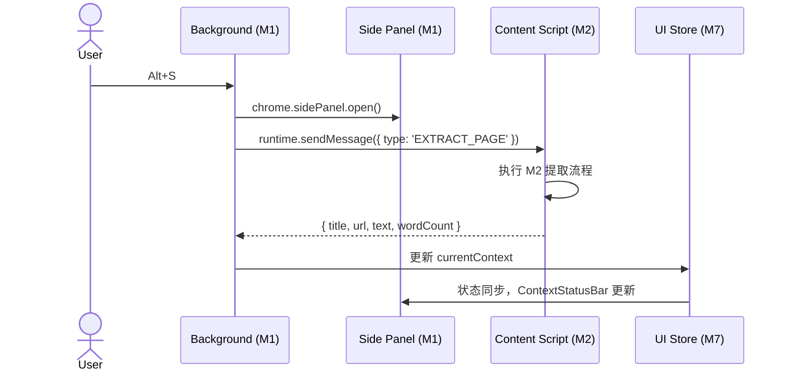

# M1 入口与布局（Entry & Layout）详细设计

> **版本**：v1.0
> **对应 PRD**：第一章「系统入口与布局职责」
> **设计原则**：入口层只负责 UI 壳与全局事件分发，不直接包含业务逻辑；所有业务状态通过 M7（Storage & Data）注入。

---

## 1. 设计目标

- 提供三个标准浏览器扩展入口：Popup、Side Panel、Options，并保持视觉与状态一致。
- 实现 PRD 要求的全局快捷键（`Alt/Option+S`、`Alt/Option+P`、`Escape`）。
- Side Panel 作为核心主界面，承载「当前上下文状态栏」与 Cherry 风格对话视图。
- 模块对外暴露统一的 UI 事件总线，供 M2/M4/M5/M6 订阅或调用。

---

## 2. 职责边界

| 职责 | 属于本模块 | 不属于本模块 |
|---|---|---|
| Popup / Side Panel / Options 页面结构 | ✅ |  |
| 全局快捷键注册与路由 | ✅ |  |
| 入口间状态同步（Pinia + chrome.storage） | ✅ |  |
| 主题 / 布局组件 | ✅ |  |
| 正文提取算法 |  | M2 |
| LLM 请求与流式渲染 |  | M3 / M4 |
| 数据持久化实现 |  | M7 |
| RSS 后台逻辑 |  | M8 |

---

## 3. 核心数据结构

### 3.1 入口路由表

```ts
// entrypoints/shared/routes.ts
export enum AppRoute {
  Home = 'home',           // Side Panel 主对话页
  History = 'history',     // 历史记录列表
  Settings = 'settings',   // Options / 设置
  Workflows = 'workflows', // 高阶工作流入口
}

export interface RouteMeta {
  route: AppRoute;
  params?: Record<string, string>;
}
```

### 3.2 全局 UI 状态（Pinia，跨入口同步）

```ts
// stores/ui.store.ts
export interface UIState {
  activeRoute: AppRoute;
  sidePanelOpen: boolean;
  currentContext: {
    tabId: number | null;
    url: string;
    title: string;
    wordCount: number;
    extractedAt: number;
    status: 'idle' | 'extracting' | 'ready' | 'error';
  } | null;
  shortcutEnabled: boolean;
  theme: 'light' | 'dark';
}
```

---

## 4. 入口实现

### 4.1 Popup（轻量控制器）

- **WXT entrypoint**：`entrypoints/popup/`
- **功能**：
  - 显示当前页面预估字数与上下文状态。
  - 提供「打开 Side Panel」和「立即提取」按钮。
  - 提供「进入设置」快捷入口。
- **限制**：不渲染长文本、不发起 LLM 请求。

```ts
// entrypoints/popup/App.vue 伪结构
<PopupLayout>
  <ContextSummary />
  <ActionBar>
    <OpenSidePanelBtn />
    <ExtractNowBtn />
    <OpenSettingsBtn />
  </ActionBar>
</PopupLayout>
```

### 4.2 Side Panel（核心主界面）

- **WXT entrypoint**：`entrypoints/sidepanel/`
- **实现策略**：使用 Chrome 原生 Side Panel API（`sidepanel` entrypoint）。
- **布局结构**：
  - **顶部**：上下文状态栏（当前标题、字数、提取状态、刷新按钮）。
  - **中部**：对话视图（M4 负责具体渲染）。
  - **底部**：输入区 + 模型选择器（M4 组件）。
- **生命周期**：
  - `onMounted`：从 M7 恢复当前上下文与会话状态。
  - Tab 切换事件：不自动刷新上下文，仅展示「刷新提取当前 Tab」按钮。

```vue
<!-- entrypoints/sidepanel/App.vue 伪结构 -->
<SidePanelLayout>
  <ContextStatusBar />
  <ChatWorkspace />
  <InputComposer />
</SidePanelLayout>
```

### 4.3 Options（设置页）

- **WXT entrypoint**：`entrypoints/options/`
- **Tab 布局**：
  - Provider：密钥、自定义 base URL、模型名。
  - Prompts：提示词模板管理。
  - Sync：WebDAV/S3 凭据、自动备份开关。
  - RSS：订阅源管理。
  - Advanced：快捷键、主题、实验功能。

---

## 5. 全局快捷键

### 5.1 Manifest 声明（MV3）

```json
{
  "commands": {
    "open-side-panel": {
      "suggested_key": { "default": "Alt+S" },
      "description": "Open side panel and extract current page"
    },
    "toggle-side-panel": {
      "suggested_key": { "default": "Alt+P" },
      "description": "Toggle side panel visibility"
    },
    "abort-all-generations": {
      "suggested_key": { "default": "Esc" },
      "description": "Abort all running LLM requests"
    }
  }
}
```

### 5.2 Background 路由

```ts
// entrypoints/background.ts
browser.commands.onCommand.addListener(async (command) => {
  switch (command) {
    case 'open-side-panel':
      await openSidePanelAndExtract();
      break;
    case 'toggle-side-panel':
      await toggleSidePanel();
      break;
    case 'abort-all-generations':
      await broadcastAbort();
      break;
  }
});
```

### 5.3 事件说明

- `open-side-panel`：唤起 Side Panel，并静默触发 M2 对当前 Tab 提取正文。
- `toggle-side-panel`：在 Chrome 中通过 `chrome.sidePanel.open()` / 关闭 API 切换显隐。
- `abort-all-generations`：通过 runtime message 广播到所有运行中的 M3 请求，触发 AbortController。

---

## 6. 组件拆分

```
components/layout/
├── SidePanelLayout.vue      # Side Panel 根布局
├── PopupLayout.vue          # Popup 根布局
├── OptionsLayout.vue        # Options 根布局 + Tab 导航
├── ContextStatusBar.vue     # 上下文状态栏
├── ActionBar.vue            # Popup 底部操作栏
└── ThemeProvider.vue        # 主题/暗黑模式

components/shared/
├── NavTabs.vue              # Tab 切换（Options 用）
├── IconButton.vue           # 图标按钮
├── LoadingDots.vue          # 加载动画
└── EmptyState.vue           # 空状态
```

---

## 7. 关键流程

### 7.1 `Alt+S` 唤起并提取



### 7.2 Tab 切换时保持上下文

- Side Panel 监听 `chrome.tabs.onActivated` 仅用于显示当前 Tab 信息。
- **不主动重新提取**；`currentContext` 保持为上一次成功提取的页面。
- 用户点击「⟳ 刷新提取当前 Tab」时才触发新的 M2 提取。

---

## 8. 错误处理

| 错误场景 | 处理策略 |
|---|---|
| Side Panel API 不可用（非 Chrome） | 降级为打开 Popup 提示用户 |
| 快捷键冲突 | Options 中允许用户自定义快捷键 |
| 状态同步失败 | 采用 M7 的持久化 store，启动时自动重 Hydrate |

---

## 9. 测试策略

- **单元测试**：路由跳转、Pinia store 状态变化、快捷键命令解析。
- **集成测试**：Popup → Background → Side Panel 唤起链路。
- **E2E**：使用 WXT 的 dev 模式加载扩展，验证快捷键触发与 Side Panel 渲染。

---

## 10. 依赖契约

| 依赖模块 | 契约 |
|---|---|
| M7 Storage & Data | 读取/写入 `uiState` 与 `currentContext` |
| M2 Context Extraction | 通过 Background 发起提取请求，接收 `{ title, url, text, wordCount }` |
| M4 Chat Workspace | Side Panel 提供容器；M4 负责内部消息渲染与输入 |
