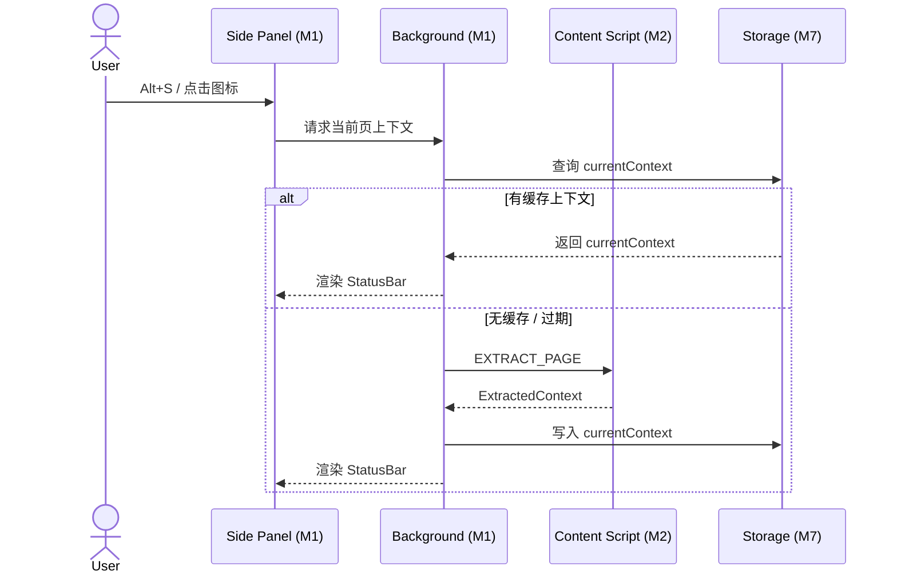

# M1 系统入口与布局（Entry & Layout）详细设计

> **版本**：v1.1
> **对应 PRD**：v3.2 第一章「系统入口与布局职责」
> **设计原则**：入口层负责 UI 容器与消息路由，不承载业务逻辑；所有 Provider/工作流/存储细节委托给对应模块。

---

## Coverage Status

> 基于 `/reference/nextai-translator` 与 `/reference/obsidian-clipper` 源码分析。

| 需求项 | 覆盖状态 | 参考实现 | 备注 |
|--------|---------|---------|------|
| Popup 小窗入口 | **已覆盖** | nextai-translator | 点击图标弹出 380x500 浮层，`popup/index.html`，`browser.action.onClicked` |
| Side Panel 固定侧边栏 | **已覆盖** | nextai-translator | `side_panel` 权限 + `chrome.sidePanel.setPanelBehavior({ openPanelOnActionClick: true })` |
| Options 管理页 | **已覆盖** | nextai-translator | 独立 HTML 页面，Provider 管理、模板编辑、RSS 订阅 |
| 全局快捷键（Alt+S / Alt+P / Escape） | **已覆盖** | nextai-translator | `commands._execute_action` 切换 Side Panel；无 Escape 快捷关窗 |
| 状态栏（当前 Tab 标题 + 上下文状态） | **未覆盖** | obsidian-clipper | Side Panel 顶部 Status Bar 设计可参考 |

**综合评估**：入口布局是相对固定的结构，nextai-translator 的 Popup/Side Panel 组织方式可直接迁移。状态栏和快捷键需小幅扩展。

**优先级建议**：P0 — 项目的物理骨架，需第一个搭建。

---

## 1. 设计目标

- 提供三种入口方式：Popup 浮层、Side Panel 侧边栏、Options 管理页。
- 实现全局快捷键：`Alt + S`（打开/关闭 Side Panel）、`Alt + P`（打开 Popup）、`Escape`（关闭当前浮层）。
- 顶部状态栏显示当前激活 Tab 标题与上下文提取状态（是否已提取 / 提取中 / 提取时间 / 字数）。
- 所有模块的 UI 根容器在此定义，消息路由到 M4 Chat Workspace。

---

## 2. 职责边界

| 职责 | 属于本模块 | 不属于本模块 |
|---|---|---|
| Popup / Side Panel / Options 页面骨架 | ✅ |  |
| 快捷键注册与响应 | ✅ |  |
| 入口间切换 | ✅ |  |
| 状态栏 UI | ✅ |  |
| 对话框/确认弹窗 | ✅ |  |
| 消息实际渲染 |  | M4 |
| LLM 调用 |  | M3 |
| 数据持久化 |  | M7 |

---

## 3. 核心设计

### 3.1 三种入口

#### 3.1.1 Popup 浮层

- 触发：用户点击浏览器工具栏扩展图标。
- 尺寸：380x500 像素，Google 推荐尺寸。
- 定位：工具栏下方弹出，点击外部自动关闭。
- 特点：轻量级、即用即走，适合短对话。
- 清单配置：

```json
// manifest.json
{
  "action": {
    "default_popup": "popup/index.html",
    "default_title": "AI Reader"
  }
}
```

#### 3.1.2 Side Panel 侧边栏

- 触发：`Alt + S` 快捷键 / 浏览器侧边栏按钮。
- 尺寸：自适应宽度（默认 400px，用户可拖拽调整）。
- 特点：始终可见，适合长期对话、工作流编排、结果对比。
- 清单配置：

```json
{
  "side_panel": {
    "default_path": "sidepanel/index.html"
  },
  "permissions": ["sidePanel"]
}
```

- Behavior 设置（nextai-translator 方案）：

```ts
chrome.sidePanel.setPanelBehavior({ openPanelOnActionClick: false });
```

#### 3.1.3 Options 管理页

- 触发：右键扩展图标 → 「选项」/ `chrome://extensions` → 详情 → 扩展程序选项。
- 页面：独立 HTML，包含 Provider 管理、提示词模板编辑、RSS 订阅源管理、缓存管理等。
- 清单配置：

```json
{
  "options_ui": {
    "page": "options/index.html",
    "open_in_tab": true
  }
}
```

### 3.2 全局快捷键

```json
{
  "commands": {
    "toggle-side-panel": {
      "suggested_key": { "default": "Alt+S" },
      "description": "打开/关闭 Side Panel"
    },
    "open-popup": {
      "suggested_key": { "default": "Alt+P" },
      "description": "打开 Popup 浮层"
    },
    "_execute_action": {
      "suggested_key": { "default": "" }
    }
  }
}
```

- `Escape`：在 Popup / Side Panel 内监听 `keydown` 事件，按下 Escape 关闭当前浮层或中止正在进行的请求。

### 3.3 状态栏

Side Panel 顶部固定显示：

```
┌──────────────────────────────────────────┐
│ ◀ 返回  │ 当前 Tab 标题          │ 13:45 │
│         │ ✅ 已提取 · 3250 字    │       │
└──────────────────────────────────────────┘
```

- 当前 Tab 标题：来自 `chrome.tabs.query({ active: true, currentWindow: true })`。
- 上下文状态：从 M7 读取 `currentContext`。
  - 未提取：显示「未提取」+ 「⟳ 提取当前页」按钮。
  - 提取中：显示加载动画。
  - 已提取：显示提取时间 + 字数。
- 无权限页面（如 `chrome://extensions/`）：显示「当前页面不支持提取」。

---

## 4. 布局组件

### 4.1 Popup 布局

```
┌───────────────────────┐
│  Header (Logo + 标题) │
├───────────────────────┤
│                       │
│  Chat Workspace       │
│  (紧凑模式)            │
│                       │
├───────────────────────┤
│  Input Composer       │
└───────────────────────┘
```

### 4.2 Side Panel 布局

```
┌───────────────────────────────────────────┐
│  Status Bar                                 │
├───────────────────────────────────────────┤
│                                             │
│  Chat Workspace                             │
│  (完整模式，含模型网格)                       │
│                                             │
├───────────────────────────────────────────┤
│  Input Composer + Model Selector            │
├───────────────────────────────────────────┤
│  Footer: 多模型性能底栏                      │
└───────────────────────────────────────────┘
```

---

## 5. 消息路由

- Background Service Worker 是消息中枢。
- 消息类型枚举：

```ts
// modules/shared/messages.ts
export type MessageType =
  | 'EXTRACT_PAGE'
  | 'CHAT_REQUEST'
  | 'ABORT_ALL_REQUESTS'
  | 'UPDATE_BADGE'
  | 'TAB_ACTIVATED'
  | 'CONTEXT_STATUS_CHANGED'
  | 'SHORTCUT_EVENT';
```

- 路由规则：Background 收到对应 MessageType，分发给各模块处理。

---

## 6. Side Panel 与 Popup 切换

- 用户可通过快捷键在两种入口间无缝切换。
- Popup 关闭时对话**不**丢失：对话状态已持久化在 M7。
- Side Panel 重新打开时自动恢复上次会话。

**注意**：Popup 宽度限制（380px），不适合多模型并排对比显示。多模型模式下 Popup 仅显示第一个模型的流式输出，通过滚动查看其余模型，并在头部提示「建议切换到 Side Panel 查看完整对比」。

---

## 7. 组件拆分

```
components/layout/
├── PopupApp.vue          # Popup 入口
├── SidePanelApp.vue      # Side Panel 入口
├── OptionsApp.vue        # Options 入口
├── StatusBar.vue         # 顶部状态栏（Side Panel）
├── AppHeader.vue         # 通用 App 头部（Popup/Side Panel）
├── ToastProvider.vue     # 全局 Toast 提示
├── ConfirmDialog.vue     # 确认对话框
└── KeyboardShortcuts.ts  # 快捷键注册与响应
```

---

## 8. UI 技术选型

| 层 | 选型 |
|----|------|
| 框架 | Vue 3 (Composition API) |
| 构建 | Vite + `crxjs/vite-plugin` |
| CSS | UnoCSS (Atomic CSS) + CSS Variables 主题系统 |
| 图标 | Iconify (`@iconify/vue`) |
| 状态管理 | Pinia + `pinia-plugin-persistedstate` |
| 统一样式体系 | UnoCSS preset `attributify` + 暗色模式适配 |
| 暗色模式 | 自动跟随系统 `prefers-color-scheme`，Options 中可手动切换 |

---

## 9. 关键流程

### 9.1 Side Panel 打开并自动提取当前页



---

## 10. 错误处理

| 错误场景 | 处理策略 |
|---|---|
| Popup / Options 加载失败 | 显示空白页面 + 刷新按钮 |
| Side Panel 在当前 Tab 不支持 | 提示用户切换到普通网页 |
| chrome.sidePanel API 不可用 | 降级为仅 Popup 模式 |
| 快捷键与其他扩展冲突 | 在 Options 中允许用户自定义快捷键 |

---

## 11. 测试策略

- **单元测试**：
  - 快捷键注册与去冲突逻辑。
  - 消息路由分发。
- **集成测试**：
  - Popup → Side Panel 切换。
  - 状态栏上下文状态变化。
  - 暗色模式切换。
- **E2E 测试**：
  - `Alt+S` 打开/关闭 Side Panel。
  - `Alt+P` 打开 Popup。
  - 提取动画与状态更新。

---

## 12. 依赖契约

| 依赖模块 | 契约 |
|---|---|
| M2 Context Extraction | Background 通过消息通道触发提取 |
| M4 Chat Workspace | Side Panel / Popup 内嵌 M4 组件，传递 `conversationId` |
| M7 Storage & Data | 读写 `currentContext`、`LastActiveTab` 等 UI 状态 |
