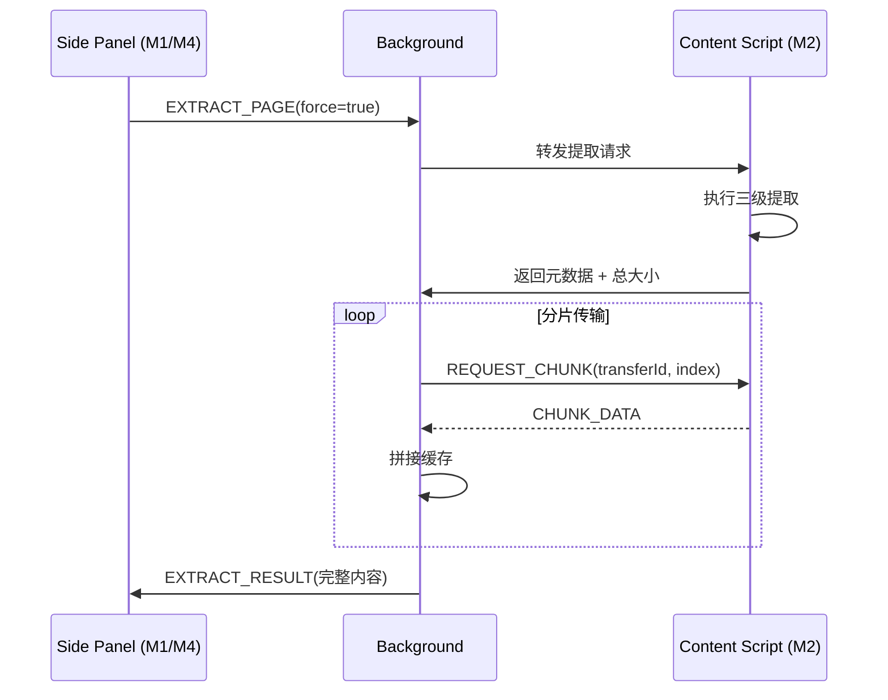

# M2 上下文提取与无界锚定（Context & Extraction）详细设计

> **版本**：v1.0
> **对应 PRD**：第二章「模块 1：上下文提取与无界锚定」、第四章长文本架构要点
> **设计原则**：提取模块是纯输入侧模块，只负责把网页 DOM 转换为结构化 Markdown/纯文本；不依赖 LLM Provider，也不关心 UI 渲染。

---

## 1. 设计目标

- 在 content script 中执行网页正文提取，三级降级：Readability → Defuddle → innerText。
- 支持「无截断长文本」：提取后**不主动截断**，按原始长度完整传输到消费端。
- 提供跨消息通道的大文本分片传输机制，避免 Chrome extension message 大小限制。
- 实现「上下文锚定」：切换 Tab 时不自动刷新，保持上一次提取结果作为对话上下文。

---

## 2. 职责边界

| 职责 | 属于本模块 | 不属于本模块 |
|---|---|---|
| DOM 解析与正文提取 | ✅ |  |
| 3 级降级策略 | ✅ |  |
| 提取结果结构化（Markdown + 元数据） | ✅ |  |
| 大文本分片传输 | ✅ |  |
| 上下文状态持久化 |  | M7 |
| LLM 调用 |  | M3 |
| UI 显示 |  | M1 / M4 |

---

## 3. 核心数据结构

### 3.1 提取结果

```ts
// modules/extraction/types.ts
export interface ExtractedContext {
  /** 当前页面 URL */
  url: string;
  /** 页面标题 */
  title: string;
  /** 站点域名 */
  siteName?: string;
  /** 提取时间戳 */
  extractedAt: number;
  /** 预估字数（中文字符 + 英文单词） */
  wordCount: number;
  /** 正文内容，Markdown 或纯文本 */
  content: string;
  /** 内容格式 */
  format: 'markdown' | 'text';
  /** 使用的提取器 */
  extractor: 'readability' | 'defuddle' | 'innerText';
  /** 原始 HTML 摘要，调试用 */
  htmlFingerprint?: string;
}
```

### 3.2 提取请求消息

```ts
export interface ExtractRequest {
  type: 'EXTRACT_PAGE';
  /** 是否强制刷新（忽略缓存） */
  force: boolean;
  /** 期望输出格式 */
  preferredFormat: 'markdown' | 'text';
}
```

### 3.3 提取响应消息

```ts
export interface ExtractResponse {
  type: 'EXTRACT_RESULT';
  success: boolean;
  context?: ExtractedContext;
  error?: {
    code: 'TIMEOUT' | 'EMPTY' | 'DOM_NOT_READY' | 'UNKNOWN';
    message: string;
  };
}
```

---

## 4. 提取器实现

### 4.1 三级降级策略

```ts
// modules/extraction/extractPage.ts
export async function extractPage(
  options: ExtractOptions = {}
): Promise<ExtractedContext> {
  // 1. Readability 本地提取
  const readability = await tryReadability();
  if (readability && readability.content.length > MIN_CONTENT_LENGTH) {
    return readability;
  }

  // 2. Defuddle 异步提取（8s 超时）
  const defuddle = await tryDefuddle({ timeout: 8000 });
  if (defuddle && defuddle.content.length > MIN_CONTENT_LENGTH) {
    return defuddle;
  }

  // 3. innerText 兜底
  return fallbackInnerText();
}
```

### 4.2 Readability 提取器

- **库**：`@mozilla/readability`
- **步骤**：
  1. `new Readability(document.cloneNode(true) as Document)`
  2. `parse()` 得到 `{ title, content, siteName, ... }`
  3. 使用 `turndown` 将 `content`（HTML）转为 Markdown。
- **失败条件**：解析为空、内容长度 `< MIN_CONTENT_LENGTH`（默认 200 字符）。

### 4.3 Defuddle 提取器

- **库**：`defuddle`（本地 npm）
- **步骤**：
  1. 调用 `defuddle(document, { markdown: true })`。
  2. 设定 8 秒超时（`Promise.race` + `setTimeout`）。
- **注意**：PRD 原文称为「API 异步解析」，但参考 Obsidian Web Clipper 的实现，采用本地库调用；若后续需要服务端 Defuddle，可通过配置切换。

### 4.4 innerText 兜底

- 移除 `<script>`、`<style>`、`<nav>`、`<footer>`、`<aside>`、`<header>`。
- 提取 `document.body.innerText`。
- 清洗多余空行，返回 `format: 'text'`。

---

## 5. 大文本分片传输

Chrome runtime message 单次 payload 有大小限制（通常 < 4MB），对于百万 Token 级文本需要分片。

### 5.1 分片协议

```ts
// modules/extraction/transfer.ts
export interface ChunkedTransfer {
  transferId: string;
  totalChunks: number;
  chunkIndex: number;
  chunkData: string;
  isLast: boolean;
}

const CHUNK_SIZE = 1024 * 1024; // 1MB per chunk
```

### 5.2 流程



### 5.3 说明

- Background 作为中转和缓存，避免 content script 与 side panel 直接长连接。
- Side Panel 接收完整内容后写入 M7，UI 层按需读取。

---

## 6. 上下文锚定机制

- 提取成功后，Background 将 `ExtractedContext` 写入 M7 的 `currentContext`。
- Side Panel 顶部状态栏从 M7 读取 `currentContext` 展示。
- Tab 切换时：
  - Background 监听 `tabs.onActivated`，仅更新 UI Store 中的当前 Tab 信息。
  - **不自动替换 `currentContext`**。
- 用户点击「⟳ 刷新提取当前 Tab」才触发新的提取流程。

---

## 7. 组件与服务拆分

```
modules/extraction/
├── index.ts              # 对外暴露 extractPage、chunkedTransfer
├── types.ts              # 数据类型
├── extractPage.ts        # 三级降级主入口
├── extractors/
│   ├── readability.ts    # @mozilla/readability 包装
│   ├── defuddle.ts       # defuddle 包装 + 超时
│   └── innerText.ts      # 兜底清洗
├── transfer.ts           # 分片传输协议
└── content-script.ts     # 注入页面的入口
```

---

## 8. 错误处理

| 错误场景 | 处理策略 |
|---|---|
| Readability 返回空 | 自动降级到 Defuddle |
| Defuddle 超时 | 降级到 innerText，并记录 `extractor: 'innerText'` |
| 所有提取器失败 | 返回 `EMPTY` 错误，UI 显示「无法提取正文」 |
| DOM 未就绪 | 等待 `DOMContentLoaded` 后重试一次 |
| 跨消息传输中断 | 支持断点续传（按 chunkIndex 重传） |

---

## 9. 性能与安全

- **性能**：提取在 content script 主线程执行；Defuddle 若耗时较长，可放入 `OffscreenDocument` 或 Web Worker（MV3 限制下可选）。
- **安全**：提取结果可能包含外部 HTML，但在提取阶段**不渲染**；渲染前由 M4 使用 DOMPurify 净化。
- **CSP**：content script 运行在原页面，避免使用 `eval`；Readability/Defuddle 不应依赖 `eval`。

---

## 10. 测试策略

- **单元测试**：
  - 各提取器对标准测试 HTML 的输出。
  - 分片传输的重组正确性。
  - 降级链路覆盖。
- **集成测试**：
  - 在真实页面（新闻、博客、SPA）触发提取。
  - 超大文本（>10MB）分片传输稳定性。
- **Mock 数据**：准备 5 类典型网页快照用于回归测试。

---

## 11. 依赖契约

| 依赖模块 | 契约 |
|---|---|
| M1 Entry & Layout | 通过 Background 发起 `EXTRACT_PAGE` 请求 |
| M7 Storage & Data | 将 `ExtractedContext` 持久化；提供 `currentContext` 读取 |
| M4 Chat Workspace | 消费 `ExtractedContext` 作为对话上下文 |
