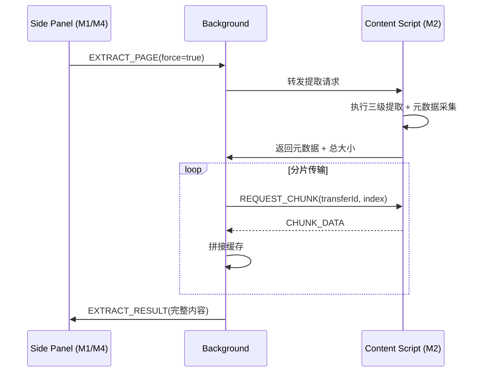

# M2 上下文提取与无界锚定（Context & Extraction）详细设计

> **版本**：v1.1
> **对应 PRD**：v3.2 第二章「模块 1：上下文提取与无界锚定」、第四章长文本架构要点
> **设计原则**：提取模块是纯输入侧模块，只负责把网页 DOM 转换为结构化 Markdown/纯文本；不依赖 LLM Provider，也不关心 UI 渲染。

---

## Coverage Status

> 基于 `/reference/obsidian-clipper` 源码分析 — 该项目与 proposal M2 提取路径完全一致。

| 需求项 | 覆盖状态 | 参考实现 | 备注 |
|--------|---------|---------|------|
| defuddle 本地 → defuddle 远程 → innerText 三级降级 | **已覆盖** | obsidian-clipper | `utils/content-extractor.ts` + `utils/reader.ts`，`Defuddle.parseAsync()` 完整实现，含 Markdown 转换（`createMarkdownContent`） |
| 结构化元数据提取（Preset/Meta/Schema.org） | **已覆盖** | obsidian-clipper | 五类变量系统 + `addSchemaOrgDataToVariables()` |
| 高亮选区提取 | **已覆盖** | obsidian-clipper | Highlighter 系统：三种内容模式 + 跨会话持久化 + 域名分组 |
| 选区交互增强（浮动工具栏 / 右键菜单 / Shadow DOM） | **部分覆盖** | WebChatAI / Cherry Studio / iFocal | 浮动工具栏定位、右键菜单注入、Shadow DOM 隔离 |
| 全文不截断提取 | **已覆盖** | obsidian-clipper | defuddle 原生支持全文提取，无长度限制 |
| 大文本分片传输 | **未覆盖** | — | 两个项目均通过 `browser.runtime.sendMessage` 单次传输，无分片机制 |
| 上下文静默锚定 | **未覆盖** | — | 无 Tab 切换保持内容的设计 |

**综合评估**：核心提取路径可直接复用 obsidian-clipper 的 defuddle 集成方案，是 proposal 所有模块中成熟度最高的。仅需补充分片传输协议与锚定逻辑。

**优先级建议**：P1 — 提取核心已有现成实现，开发重点为结构化元数据、选区增强、分片传输与锚定。

---

## 1. 设计目标

- 在 content script 中执行网页正文提取，三级降级：defuddle 本地 → defuddle 远程 API → innerText。
- 提取时同步采集结构化元数据（Preset 预置变量、Meta 元变量、Schema.org 结构化数据），注入 Prompt 上下文。
- 支持高亮选区提取：用户划选内容后以三种模式嵌入或独立输出，高亮数据跨会话持久化。
- 支持选区交互增强：浮动工具栏（解释/总结/翻译/提问）、右键菜单集成、Shadow DOM 样式隔离。
- 支持「无截断长文本」：提取后**不主动截断**，按原始长度完整传输到消费端。
- 提供跨消息通道的大文本分片传输机制，避免 Chrome extension message 大小限制。
- 实现「上下文锚定」：切换 Tab 时不自动刷新，保持上一次提取结果作为对话上下文。

---

## 2. 职责边界

| 职责 | 属于本模块 | 不属于本模块 |
|---|---|---|
| DOM 解析与正文提取 | ✅ |  |
| 3 级降级策略（defuddle 本地 → 远程 → innerText） | ✅ |  |
| 结构化元数据采集（Preset/Meta/Schema.org） | ✅ |  |
| 高亮选区提取与持久化 | ✅ |  |
| 选区浮动工具栏、右键菜单、Shadow DOM | ✅ |  |
| 大文本分片传输 | ✅ |  |
| 上下文状态持久化 |  | M7 |
| LLM 调用 |  | M3 |
| UI 显示（除浮动工具栏和右键菜单外） |  | M1 / M4 |

---

## 3. 核心数据结构

### 3.1 提取结果

```ts
// modules/extraction/types.ts
export interface ExtractedContext {
  /** 当前页面 URL */
  url: string;
  /** 页面标题 */
  title: string;
  /** 站点域名 */
  siteName?: string;
  /** 作者 */
  author?: string;
  /** 页面描述 */
  description?: string;
  /** 发布日期 */
  published?: string;
  /** 网站图标 URL */
  favicon?: string;
  /** 社交分享图 URL */
  image?: string;
  /** 提取时间戳 */
  extractedAt: number;
  /** 预估字数（中文字符 + 英文单词） */
  wordCount: number;
  /** 正文内容，Markdown 或纯文本 */
  content: string;
  /** 内容格式 */
  format: 'markdown' | 'text';
  /** 使用的提取器 */
  extractor: 'defuddle' | 'defuddle-remote' | 'innerText';
  /** 原始 HTML 摘要，调试用 */
  htmlFingerprint?: string;
  /** 结构化元数据 */
  metadata: ExtractedMetadata;
  /** 高亮选区数据（如有） */
  highlights?: HighlightData[];
}

export interface ExtractedMetadata {
  /** Preset 预置变量 */
  preset: {
    title: string;
    author: string;
    description: string;
    published: string;
    site: string;
    domain: string;
    favicon: string;
    image: string;
    words: number;
  };
  /** Meta 元变量（Open Graph 等） */
  meta: Record<string, string>;
  /** Schema.org 结构化数据 */
  schemaOrg: Record<string, unknown>;
}
```

### 3.2 高亮选区数据

```ts
export interface HighlightData {
  id: string;
  /** 所属域名 */
  domain: string;
  /** 页面 URL */
  pageUrl: string;
  /** 高亮文本内容 */
  text: string;
  /** 高亮样式类型 */
  style: 'underline-dot' | 'background' | 'blur' | 'wave' | 'weak' | 'border' | 'divider' | 'italic' | 'bold' | 'custom';
  /** 自定义 CSS（style=custom 时使用） */
  customCSS?: string;
  /** 用户标签（重点/疑问/待办） */
  tag?: 'important' | 'question' | 'todo';
  createdAt: number;
}
```

### 3.3 提取请求/响应消息

```ts
export interface ExtractRequest {
  type: 'EXTRACT_PAGE';
  /** 是否强制刷新（忽略缓存） */
  force: boolean;
  /** 期望输出格式 */
  preferredFormat: 'markdown' | 'text';
  /** 高亮模式 */
  highlightMode?: 'embed' | 'list-only' | 'ignore';
}

export interface ExtractResponse {
  type: 'EXTRACT_RESULT';
  success: boolean;
  context?: ExtractedContext;
  error?: {
    code: 'TIMEOUT' | 'EMPTY' | 'DOM_NOT_READY' | 'UNKNOWN';
    message: string;
  };
}
```

---

## 4. 提取器实现

### 4.1 三级降级策略（defuddle 首选）

PRD v3.2 明确 defuddle 为首选方案——其 `createMarkdownContent()` 可直接将网页正文转为结构化 Markdown，相比 Readability + turndown 两步走更简洁。

```ts
// modules/extraction/extractPage.ts
export async function extractPage(
  options: ExtractOptions = {}
): Promise<ExtractedContext> {
  const metadata = extractMetadata();

  // 1. defuddle 本地提取（首选）
  const local = await tryDefuddleLocal({ timeout: 5000 });
  if (local && local.content.length > MIN_CONTENT_LENGTH) {
    return { ...local, metadata, extractor: 'defuddle' };
  }

  // 2. defuddle 远程 API 异步解析（8s 超时）
  const remote = await tryDefuddleRemote({ timeout: 8000 });
  if (remote && remote.content.length > MIN_CONTENT_LENGTH) {
    return { ...remote, metadata, extractor: 'defuddle-remote' };
  }

  // 3. innerText 兜底
  return { ...fallbackInnerText(), metadata, extractor: 'innerText' };
}
```

### 4.2 defuddle 本地提取器（首选）

- **库**：`defuddle`（本地 npm 包）
- **步骤**：
  1. 调用 `defuddle(document, { markdown: true })`。
  2. 使用 `createMarkdownContent()` 将正文直接输出为结构化 Markdown。
  3. 设定 5 秒超时（`Promise.race` + `setTimeout`）。
- **优势**：一步完成 DOM 正文提取到 Markdown 转换，剥离广告、导航栏等噪音，代码路径更短。
- **失败条件**：解析为空、内容长度 `< MIN_CONTENT_LENGTH`（默认 200 字符）、超时。

### 4.3 defuddle 远程 API（降级一）

- 当本地 defuddle 提取异常或返回空内容时触发。
- 调用 Defuddle 服务端接口执行智能提取，设定 8 秒超时限制。
- 复用 obsidian-clipper 已验证的 `extractPageContent` + `initializePageContent` 双阶段提取模式：先获取基础元数据再异步加载正文。

### 4.4 innerText 兜底（降级二）

- 移除 `<script>`、`<style>`、`<nav>`、`<footer>`、`<aside>`、`<header>`。
- 提取 `document.body.innerText`。
- 清洗多余空行，返回 `format: 'text'`。

---

## 5. 结构化元数据提取

借鉴 obsidian-clipper 的五类变量系统，提取页面时同步采集以下元数据，作为系统预置变量注入 Prompt 上下文以提升 AI 理解精度：

### 5.1 Preset 预置变量

```ts
function extractPresetVars(): PresetVars {
  return {
    title: document.title,
    author: extractAuthor(),
    description: getMetaContent('description'),
    published: extractPublishedDate(),
    site: extractSiteName(),
    domain: window.location.hostname,
    favicon: getFaviconUrl(),
    image: getMetaContent('og:image') || extractFirstImage(),
    words: countWords(document.body.innerText),
  };
}
```

### 5.2 Meta 元变量

通过 `<meta>` 标签提取 Open Graph 数据：
- `og:title`、`og:description`、`og:image`、`og:type`、`og:url` 等
- 其他 `<meta>` 标签的 name/content 对

### 5.3 Schema.org 结构化数据

解析页面 JSON-LD / Microdata，提取类型化信息：
- `@Article`：headline、author、datePublished
- `@Recipe`：name、ingredients、instructions
- `@Product`：name、price、description
- 用于智能分类和上下文增强

```ts
function extractSchemaOrg(): Record<string, unknown> {
  const scripts = document.querySelectorAll('script[type="application/ld+json"]');
  const results: Record<string, unknown>[] = [];
  scripts.forEach((s) => {
    try { results.push(JSON.parse(s.textContent || '')); } catch { /* skip */ }
  });
  return { items: results };
}
```

---

## 6. 高亮选区提取

借鉴 obsidian-clipper 的 Highlighter 系统，用户在页面上划选文本/图片/元素后，系统自动识别选区并支持三种内容模式：

### 6.1 三种内容模式

| 模式 | 行为 |
|------|------|
| `embed` | 嵌入高亮标记的完整正文，使用 `==highlight==` 语法标记 |
| `list-only` | 仅提取高亮内容列表，不包含未高亮原文 |
| `ignore` | 忽略高亮，保持原文 |

### 6.2 高亮持久化

- 高亮数据使用 Dexie.js 按域名分组存储（`highlights` 表）。
- 用户关闭页面后再次打开仍可通过 content script 恢复高亮标记。
- 支持 `.json` 格式导出。

### 6.3 多种标记样式预设

借鉴 iFocal，支持以下样式：
- 点状下划线（`underline-dot`）
- 高亮背景色（`background`）
- 模糊（`blur`）
- 波浪线（`wave`）
- 弱化（`weak`）
- 边框（`border`）
- 分割线（`divider`）
- 斜体（`italic`）
- 加粗（`bold`）
- 自定义 CSS（`custom`）

用户可为不同用途（重点 / 疑问 / 待办）绑定不同样式。

---

## 7. 选区交互增强

### 7.1 浮动工具栏

借鉴 WebChatAI 的选区浮动工具栏方案：

- 用户在页面上划选文本后自动弹出轻量浮动工具栏。
- 工具栏定位在选区附近，自动避开边缘区域。
- 提供四个快捷操作：解释 / 总结 / 翻译 / 提问。
- 用户点击页面空白处自动消失。

### 7.2 右键菜单集成

借鉴 Cherry Studio 扩展的右键菜单模式：

- 通过 `chrome.contextMenus` API 动态注册菜单项。
- 仅在有选区时显示 AI 操作项（解释 / 总结 / 翻译 / 朗读 / 搜索）。
- 选中文本后触发对应操作，结果在 Side Panel 中展示。

### 7.3 Shadow DOM 样式隔离

借鉴 iFocal 的隔离方案：

- 浮动工具栏和右键注入 UI 均使用 Shadow DOM 承载。
- 配合样式命名隔离（BEM 或 CSS Modules），彻底避免注入的 UI 组件与宿主页面 CSS 发生冲突。
- 确保在任何网页上均保持一致的视觉表现。

---

## 8. 大文本分片传输

Chrome runtime message 单次 payload 有大小限制（通常 < 4MB），对于百万 Token 级文本需要分片。

### 8.1 分片协议

```ts
// modules/extraction/transfer.ts
export interface ChunkedTransfer {
  transferId: string;
  totalChunks: number;
  chunkIndex: number;
  chunkData: string;
  isLast: boolean;
}

const CHUNK_SIZE = 1024 * 1024; // 1MB per chunk
```

### 8.2 流程



### 8.3 说明

- Background 作为中转和缓存，避免 content script 与 side panel 直接长连接。
- Side Panel 接收完整内容后写入 M7，UI 层按需读取。

---

## 9. 上下文锚定机制

- 提取成功后，Background 将 `ExtractedContext` 写入 M7 的 `currentContext`。
- Side Panel 顶部状态栏从 M7 读取 `currentContext` 展示。
- Tab 切换时：
  - Background 监听 `tabs.onActivated`，仅更新 UI Store 中的当前 Tab 信息。
  - **不自动替换 `currentContext`**。
- 用户点击「⟳ 刷新提取当前 Tab」才触发新的提取流程。

---

## 10. 组件与服务拆分

```
modules/extraction/
├── index.ts              # 对外暴露 extractPage、chunkedTransfer
├── types.ts              # 数据类型
├── extractPage.ts        # 三级降级主入口
├── metadata.ts           # 结构化元数据提取（Preset/Meta/Schema.org）
├── extractors/
│   ├── defuddle-local.ts # defuddle 本地提取（首选）
│   ├── defuddle-remote.ts# defuddle 远程 API（降级一）
│   └── innerText.ts      # 兜底清洗（降级二）
├── highlights/
│   ├── highlighter.ts    # 选区识别 + 标记注入
│   ├── styles.ts         # 多种标记样式预设
│   └── persistence.ts    # Dexie 持久化 + 导出
├── interaction/
│   ├── floating-bar.ts   # 浮动工具栏（Shadow DOM）
│   ├── context-menu.ts   # 右键菜单注册
│   └── shadow-dom.ts     # Shadow DOM 隔离工具
├── transfer.ts           # 分片传输协议
└── content-script.ts     # 注入页面的入口
```

---

## 11. 错误处理

| 错误场景 | 处理策略 |
|---|---|
| defuddle 本地返回空 | 自动降级到 defuddle 远程 |
| defuddle 远程超时 | 降级到 innerText，并记录 `extractor: 'innerText'` |
| 所有提取器失败 | 返回 `EMPTY` 错误，UI 显示「无法提取正文」 |
| DOM 未就绪 | 等待 `DOMContentLoaded` 后重试一次 |
| 跨消息传输中断 | 支持断点续传（按 chunkIndex 重传） |
| 高亮恢复失败 | 静默降级，不影响正文提取 |

---

## 12. 性能与安全

- **性能**：提取在 content script 主线程执行；defuddle 若耗时较长，可放入 `OffscreenDocument` 或 Web Worker（MV3 限制下可选）。
- **安全**：提取结果可能包含外部 HTML，但在提取阶段**不渲染**；渲染前由 M4 使用 DOMPurify 净化。
- **CSP**：content script 运行在原页面，避免使用 `eval`；defuddle 不应依赖 `eval`。
- **浮动工具栏安全**：Shadow DOM 隔离确保注入 UI 不会被宿主页面脚本访问或篡改。

---

## 13. 测试策略

- **单元测试**：
  - 各提取器对标准测试 HTML 的输出。
  - 分片传输的重组正确性。
  - 降级链路覆盖。
  - 元数据提取（Preset/Meta/Schema.org）完整性。
  - 高亮样式注入正确性。
- **集成测试**：
  - 在真实页面（新闻、博客、SPA）触发提取。
  - 超大文本（>10MB）分片传输稳定性。
  - 浮动工具栏在不同页面布局下的定位。
  - 右键菜单注入与点击触发流程。
- **Mock 数据**：准备 5 类典型网页快照用于回归测试。

---

## 14. 依赖契约

| 依赖模块 | 契约 |
|---|---|
| M1 Entry & Layout | 通过 Background 发起 `EXTRACT_PAGE` 请求 |
| M7 Storage & Data | 将 `ExtractedContext` 持久化；提供 `currentContext` 读取；存储高亮数据 |
| M4 Chat Workspace | 消费 `ExtractedContext`（含 metadata）作为对话上下文 |
