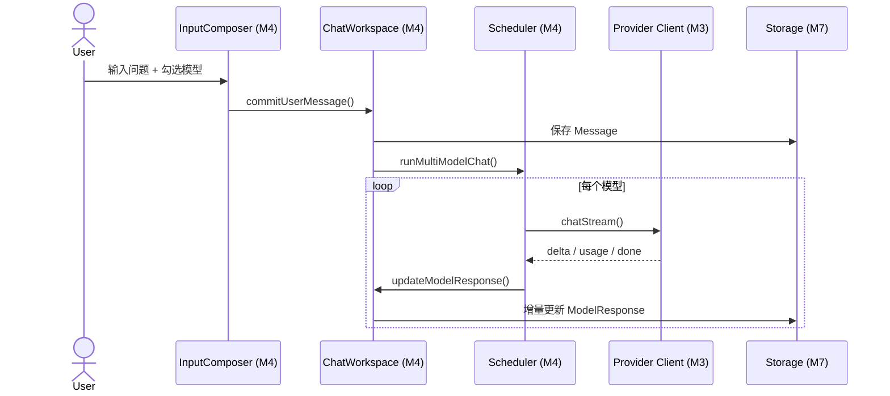

# M4 Cherry 风格多模型工作区（Chat Workspace）详细设计

> **版本**：v1.0
> **对应 PRD**：第二章「模块 2：Cherry 风格多模型工作区」、第四章长文本渲染避坑点
> **设计原则**：工作区只负责对话状态管理、多模型调度与消息渲染；所有 LLM 细节委托给 M3，数据持久化委托给 M7。

---

## 1. 设计目标

- 支持 1~4 个模型并发请求，以并排栏目或内嵌标签页展示结果。
- 各模型独立 SSE 连接，流式渲染互不阻塞，支持独立重试/中止。
- 底部硬编码显示：耗时(ms) | TTFT | Tokens/s | 消耗量预估。
- 支持「单分支追问」：点击模型卡片底部「以此继续」，分离出针对该模型的单线对话流。
- 长文本生成时，采用增量追加 + `requestAnimationFrame` 节流，避免全量重渲染导致卡顿。

---

## 2. 职责边界

| 职责 | 属于本模块 | 不属于本模块 |
|---|---|---|
| 会话状态管理 | ✅ |  |
| 多模型并发调度 | ✅ |  |
| 消息气泡与模型卡片渲染 | ✅ |  |
| 流式文本增量渲染 | ✅ |  |
| 分支追问 | ✅ |  |
| LLM API 请求实现 |  | M3 |
| 上下文提取 |  | M2 |
| 数据持久化 |  | M7 |

---

## 3. 核心数据结构

### 3.1 会话（Conversation）

```ts
// modules/workspace/types.ts
export interface Conversation {
  id: string;
  title: string;
  createdAt: number;
  updatedAt: number;
  /** 当前分支的根消息 ID */
  rootMessageId: string;
  /** 参与本次会话的 Provider ID 列表 */
  activeProviderIds: string[];
  /** 会话类型 */
  mode: 'chat' | 'roundtable' | 'relay';
}
```

### 3.2 消息（Message）

```ts
export interface Message {
  id: string;
  conversationId: string;
  /** 父消息 ID，用于分支追问 */
  parentId: string | null;
  role: 'user' | 'assistant';
  /** 用户发送的原始内容 */
  content?: string;
  /** 多模型回复集合 */
  modelResponses: ModelResponse[];
  createdAt: number;
}
```

### 3.3 模型回复（ModelResponse）

```ts
export interface ModelResponse {
  providerId: string;
  model: string;
  /** 生成状态 */
  status: 'pending' | 'streaming' | 'done' | 'error' | 'aborted';
  /** 已生成的文本 */
  content: string;
  /** 性能指标（M3 返回） */
  metrics: RequestMetrics;
  /** 错误信息 */
  error?: { code: string; message: string };
  /** 下游分支会话 ID（用于「以此继续」） */
  branchConversationId?: string;
}
```

---

## 4. 多模型并发调度

### 4.1 调度器

```ts
// modules/workspace/scheduler.ts
export async function runMultiModelChat(
  conversation: Conversation,
  userMessage: Message,
  providers: ProviderConfig[],
  context: ExtractedContext | null,
  callbacks: {
    onDelta: (providerId: string, delta: string) => void;
    onStatus: (providerId: string, status: ModelResponse['status']) => void;
    onMetrics: (providerId: string, metrics: RequestMetrics) => void;
  }
): Promise<void> {
  const systemPrompt = buildSystemPrompt(context);
  const messages = buildHistory(conversation, userMessage);

  await Promise.all(
    providers.map((provider) =>
      runSingleModel(provider, systemPrompt, messages, callbacks)
    )
  );
}
```

### 4.2 单模型执行

```ts
async function runSingleModel(
  providerConfig: ProviderConfig,
  systemPrompt: string,
  messages: ChatMessage[],
  callbacks
) {
  const provider = createProvider(providerConfig);
  const request: ChatRequest = {
    providerId: providerConfig.id,
    systemPrompt,
    messages,
  };

  callbacks.onStatus(providerConfig.id, 'streaming');

  await provider.chatStream(request, (event) => {
    switch (event.type) {
      case 'delta':
        callbacks.onDelta(providerConfig.id, event.content);
        break;
      case 'usage':
      case 'done':
        // metrics 在 chatStream 返回时统一处理
        break;
      case 'error':
        callbacks.onStatus(providerConfig.id, 'error');
        break;
    }
  });
}
```

---

## 5. 流式渲染策略

### 5.1 增量追加

- 每收到一个 `delta`，直接追加到对应 `ModelResponse.content`。
- **禁止**在每次 delta 时对整个历史上下文重新执行 `markdown-it.render()`。
- 仅对最新文本块执行 Markdown 渲染，并缓存已渲染的 HTML。

### 5.2 节流渲染

```ts
// 伪代码
let pendingRenders = new Map<string, string>();

function scheduleRender(providerId: string) {
  if (renderScheduled.has(providerId)) return;
  renderScheduled.set(providerId, true);

  requestAnimationFrame(() => {
    renderScheduled.delete(providerId);
    const content = modelResponse.content;
    const html = markdownIt.render(content);
    updateDOM(providerId, html);
  });
}
```

### 5.3 长文本滚动帧率

- 目标：生成过程中滚动帧率 ≥ 45fps。
- 措施：
  - 限制 `requestAnimationFrame` 更新频率。
  - 使用 `content-visibility: auto` 或虚拟化隐藏非视口消息。
  - 对已完成的历史消息缓存渲染结果，不再重渲染。

---

## 6. 数据透视底栏

每个模型卡片底部固定显示：

```ts
<ModelCardFooter
  latency={metrics.totalLatency}
  ttft={metrics.firstTokenTime - metrics.startTime}
  tokensPerSecond={metrics.tokensPerSecond}
  estimatedCost={metrics.estimatedCost}
/>
```

指标由 M3 实时返回，UI 只做展示。

---

## 7. 单分支追问

### 7.1 交互

- 用户点击某模型卡片底部的「以此继续」。
- 系统基于该模型当前回复内容，创建一个新的分支会话（`Conversation`）。
- 新会话的 `parentId` 指向原消息，仅保留该模型的回复作为上下文。

### 7.2 数据结构

```ts
export interface ConversationBranch {
  branchId: string;
  parentConversationId: string;
  parentMessageId: string;
  sourceProviderId: string;
  sourceModelResponseId: string;
}
```

---

## 8. 组件拆分

```
components/workspace/
├── ChatWorkspace.vue       # 工作区根组件
├── MessageList.vue         # 消息列表（虚拟滚动）
├── UserMessage.vue         # 用户提问气泡
├── ModelGrid.vue           # 多模型并排栏目
├── ModelCard.vue           # 单个模型输出卡片
├── ModelCardFooter.vue     # 数据透视底栏
├── InputComposer.vue       # 输入框 + 模型选择器
├── ModelSelector.vue       # 1~4 模型勾选器
├── BranchPrompt.vue        # 分支追问提示
└── StreamingText.vue       # 增量渲染文本
```

---

## 9. 关键流程

### 9.1 用户发送消息并触发多模型生成



---

## 10. 错误处理

| 错误场景 | 处理策略 |
|---|---|
| 模型返回错误 | 对应 `ModelResponse.status = 'error'`，不影响其他模型 |
| 用户 Abort | 对应 `ModelResponse.status = 'aborted'` |
| 渲染卡死 | 启用节流 + 虚拟滚动；单条消息过大时折叠 |
| 历史消息加载失败 | 从 M7 懒加载，失败时显示重试按钮 |

---

## 11. 测试策略

- **单元测试**：
  - 调度器并发行为。
  - `ModelResponse` 状态机转换。
  - 增量渲染节流逻辑。
- **集成测试**：
  - 用 mock Provider 验证 4 模型并发 UI 更新。
  - 分支追问后历史上下文正确性。
- **性能测试**：
  - 100K tokens 文本生成时滚动帧率监控。

---

## 12. 依赖契约

| 依赖模块 | 契约 |
|---|---|
| M3 Provider & LLM Client | 调用 `createProvider` 与 `chatStream`，消费 `StreamEvent` / `RequestMetrics` |
| M7 Storage & Data | 读取/写入 Conversation、Message、ModelResponse；懒加载历史 |
| M2 Context Extraction | 读取 `currentContext` 作为 system prompt 上下文 |
| M1 Entry & Layout | Side Panel 提供容器与状态栏 |
