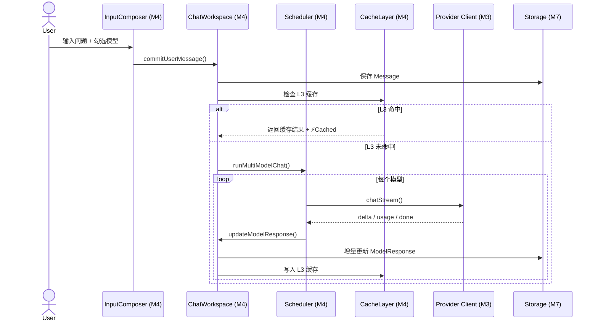

# M4 Cherry 风格多模型工作区（Chat Workspace）详细设计

> **版本**：v1.1
> **对应 PRD**：v3.2 第二章「模块 2：Cherry 风格多模型工作区」、第四章长文本渲染避坑点
> **设计原则**：工作区只负责对话状态管理、多模型调度与消息渲染；所有 LLM 细节委托给 M3，数据持久化委托给 M7。

---

## Coverage Status

> 基于 `/reference/nextai-translator` 源码分析。

| 需求项 | 覆盖状态 | 参考实现 | 备注 |
|--------|---------|---------|------|
| 单模型流式渲染 | **已覆盖** | nextai-translator | `translate.ts` 中 `onMessage` 回调逐 chunk 追加 |
| rAF 节流增量渲染 | **部分覆盖** | obsidian-clipper | `reader.ts` 使用 `requestAnimationFrame` 做滚动动画 |
| 1~4 模型并发调度 | **未覆盖** | — | nextai 单模型单次；proposal 需 4 路并发 + 独立 SSE 连接 |
| 数据透视底栏（耗时/TTFT/Tokens/s） | **未覆盖** | — | 无性能指标统计 |
| 单分支追问 | **未覆盖** | — | 无对话分支概念 |
| 提示词模板系统（变量 + URL 触发规则） | **部分覆盖** | obsidian-clipper | 40+ 模板变量系统 + AST 编译器，可完整迁移 |
| Filter 管道（40+ Filter） | **部分覆盖** | obsidian-clipper | 文本转换 / 结构转换 / 列表操作 / 日期处理四类 Filter |
| 智能缓存策略（L1/L2/L3） | **未覆盖** | Cherry Studio | 三级缓存架构 |

**综合评估**：单路流式渲染有参考。核心差异化功能（4 路并发、底栏、追问、模板系统、Filter 管道、缓存）大部分需新开发。

**优先级建议**：P3 — 依赖 M3 Provider 层完成后才能实现并发调度，单路渲染逻辑可参考 nextai。

---

## 1. 设计目标

- 支持 1~4 个模型并发请求，以并排栏目或内嵌标签页展示结果。
- 各模型独立 SSE 连接，流式渲染互不阻塞，支持独立重试/中止。
- 底部硬编码显示：耗时(ms) | TTFT | Tokens/s | 消耗量预估。
- 支持「单分支追问」：点击模型卡片底部「以此继续」，分离出针对该模型的单线对话流。
- 长文本生成时，采用增量追加 + `requestAnimationFrame` 节流，避免全量重渲染导致卡顿。
- 实现提示词模板系统：内置变量系统、URL 触发规则、多种保存行为。
- 实现 Filter 管道：模型输出支持后处理（文本转换 / 结构转换 / 列表操作 / 日期处理）。
- 内置三级智能缓存（L1 内存 / L2 持久化 / L3 API 响应），减少重复 API 调用。

---

## 2. 职责边界

| 职责 | 属于本模块 | 不属于本模块 |
|---|---|---|
| 会话状态管理 | ✅ |  |
| 多模型并发调度 | ✅ |  |
| 消息气泡与模型卡片渲染 | ✅ |  |
| 流式文本增量渲染 | ✅ |  |
| 分支追问 | ✅ |  |
| 提示词模板管理 | ✅ |  |
| Filter 管道 | ✅ |  |
| 智能缓存策略 | ✅ |  |
| LLM API 请求实现 |  | M3 |
| 上下文提取 |  | M2 |
| 数据持久化 |  | M7 |

---

## 3. 核心数据结构

### 3.1 会话（Conversation）

```ts
// modules/workspace/types.ts
export interface Conversation {
  id: string;
  title: string;
  createdAt: number;
  updatedAt: number;
  /** 当前分支的根消息 ID */
  rootMessageId: string;
  /** 参与本次会话的 Provider ID 列表 */
  activeProviderIds: string[];
  /** 会话类型 */
  mode: 'chat' | 'roundtable' | 'relay';
}
```

### 3.2 消息（Message）

```ts
export interface Message {
  id: string;
  conversationId: string;
  /** 父消息 ID，用于分支追问 */
  parentId: string | null;
  role: 'user' | 'assistant';
  /** 用户发送的原始内容 */
  content?: string;
  /** 多模型回复集合 */
  modelResponses: ModelResponse[];
  createdAt: number;
}
```

### 3.3 模型回复（ModelResponse）

```ts
export interface ModelResponse {
  providerId: string;
  model: string;
  /** 生成状态 */
  status: 'pending' | 'streaming' | 'done' | 'error' | 'aborted';
  /** 已生成的文本 */
  content: string;
  /** 性能指标（M3 返回） */
  metrics: RequestMetrics;
  /** 错误信息 */
  error?: { code: string; message: string };
  /** 下游分支会话 ID（用于「以此继续」） */
  branchConversationId?: string;
}
```

---

## 4. 多模型并发调度

### 4.1 调度器

```ts
// modules/workspace/scheduler.ts
export async function runMultiModelChat(
  conversation: Conversation,
  userMessage: Message,
  providers: ProviderConfig[],
  context: ExtractedContext | null,
  callbacks: {
    onDelta: (providerId: string, delta: string) => void;
    onStatus: (providerId: string, status: ModelResponse['status']) => void;
    onMetrics: (providerId: string, metrics: RequestMetrics) => void;
  }
): Promise<void> {
  const systemPrompt = buildSystemPrompt(context);
  const messages = buildHistory(conversation, userMessage);

  await Promise.all(
    providers.map((provider) =>
      runSingleModel(provider, systemPrompt, messages, callbacks)
    )
  );
}
```

### 4.2 单模型执行

```ts
async function runSingleModel(
  providerConfig: ProviderConfig,
  systemPrompt: string,
  messages: ChatMessage[],
  callbacks
) {
  const provider = createProvider(providerConfig);
  const request: ChatRequest = {
    providerId: providerConfig.id,
    systemPrompt,
    messages,
  };

  callbacks.onStatus(providerConfig.id, 'streaming');

  await provider.chatStream(request, (event) => {
    switch (event.type) {
      case 'delta':
        callbacks.onDelta(providerConfig.id, event.content);
        break;
      case 'usage':
      case 'done':
        // metrics 在 chatStream 返回时统一处理
        break;
      case 'error':
        callbacks.onStatus(providerConfig.id, 'error');
        break;
    }
  });
}
```

---

## 5. 流式渲染策略

### 5.1 增量追加

- 每收到一个 `delta`，直接追加到对应 `ModelResponse.content`。
- **禁止**在每次 delta 时对整个历史上下文重新执行 `markdown-it.render()`。
- 仅对最新文本块执行 Markdown 渲染，并缓存已渲染的 HTML。

### 5.2 节流渲染

```ts
// 伪代码
let pendingRenders = new Map<string, string>();

function scheduleRender(providerId: string) {
  if (renderScheduled.has(providerId)) return;
  renderScheduled.set(providerId, true);

  requestAnimationFrame(() => {
    renderScheduled.delete(providerId);
    const content = modelResponse.content;
    const html = markdownIt.render(content);
    updateDOM(providerId, html);
  });
}
```

### 5.3 长文本滚动帧率

- 目标：生成过程中滚动帧率 ≥ 45fps。
- 措施：
  - 限制 `requestAnimationFrame` 更新频率。
  - 使用 `content-visibility: auto` 或虚拟化隐藏非视口消息。
  - 对已完成的历史消息缓存渲染结果，不再重渲染。
  - 借鉴 obsidian-clipper 的 `memoizeWithExpiration` 模式：对模板编译等高频调用进行短期缓存（5s 过期 + URL 敏感 Key）。

---

## 6. 数据透视底栏

每个模型卡片底部固定显示：

```ts
<ModelCardFooter
  latency={metrics.totalLatency}
  ttft={metrics.firstTokenTime - metrics.startTime}
  tokensPerSecond={metrics.tokensPerSecond}
  estimatedCost={metrics.estimatedCost}
/>
```

指标由 M3 实时返回，UI 只做展示。

---

## 7. 单分支追问

### 7.1 交互

- 用户点击某模型卡片底部的「以此继续」。
- 系统基于该模型当前回复内容，创建一个新的分支会话（`Conversation`）。
- 新会话的 `parentId` 指向原消息，仅保留该模型的回复作为上下文。

### 7.2 数据结构

```ts
export interface ConversationBranch {
  branchId: string;
  parentConversationId: string;
  parentMessageId: string;
  sourceProviderId: string;
  sourceModelResponseId: string;
}
```

---

## 8. 提示词模板系统

借鉴 obsidian-clipper 的模板系统（40+ 变量 + AST 编译器 + URL 触发规则）。

### 8.1 模板定义

```ts
export interface PromptTemplate {
  id: string;
  name: string;
  content: string; // 含 {{variable}} 占位符
  description?: string;
  /** URL 触发规则 */
  triggerRules?: TriggerRule[];
  /** 模板行为 */
  behavior: 'new-note' | 'append-to-existing' | 'append-to-daily';
}
```

### 8.2 变量系统

借鉴 obsidian-clipper 五类变量系统：

| 变量类别 | 语法示例 | 说明 |
|----------|----------|------|
| 预设变量 | `{{content}}` `{{title}}` `{{author}}` `{{url}}` | 当前页面提取正文、标题等 |
| 选区变量 | `{{selection}}` | 用户当前划选内容 |
| Meta 变量 | `{{meta:property:og:title}}` | `<meta>` 标签数据 |
| Schema.org 变量 | `{{schema:@Article.headline}}` | JSON-LD 结构化数据 |
| 筛选器变量 | `{{selectorHtml:#main}}` | 限制 LLM 上下文范围，减少 Token 消耗 |

### 8.3 URL 触发规则

模板支持基于当前页面 URL 自动匹配：

```ts
export interface TriggerRule {
  type: 'simple' | 'regex' | 'schema-type';
  /** 简单匹配：example.com/blog */
  pattern?: string;
  /** Schema.org 类型：@Article / @Recipe */
  schemaType?: string;
}
```

当用户打开匹配规则的页面时，系统自动切换对应模板。

### 8.4 模板安全

借鉴 obsidian-clipper 的 AST-based 模板编译器（`template-compiler.ts` → `renderer.ts`）：

- 变量解析走编译期静态分析而非运行时 `eval()`，杜绝代码注入风险。
- 变量引用使用 `{{variableName}}` 或 `{{variableName|filter}}` 语法。
- Filter 链严格控制白名单，不得执行任意 JavaScript。

---

## 9. Filter 管道

借鉴 obsidian-clipper 40+ Filter 系统，模型输出支持后处理管道。

### 9.1 Filter 分类

| 类别 | Filter | 说明 |
|------|--------|------|
| **文本转换** | `capitalize` `upper` `lower` `trim` `replace` `strip_tags` `strip_md` `safe_name` | 大小写、去空格、去除 HTML/MD 标签、安全文件名 |
| **结构转换** | `blockquote` `callout` `table` `link` `footnote` | 转引用块 / Callout 语法 / 表格 / Wiki 链接 / 脚注 |
| **列表操作** | `slice` `reverse` `merge` `join` `map` `template` | 截取、反转、合并、连接、映射 |
| **日期处理** | `date` `date_modify` | 日期格式化、日期偏移 |

### 9.2 Filter 链

```ts
// 变量 → Filter 链
"{{content|strip_tags|trim|blockquote}}"
// 含义：提取正文 → 去除 HTML 标签 → 去除首尾空白 → 转换为引用块
```

### 9.3 实现

- Filter 函数为纯函数，输入字符串输出字符串。
- 通过 `FilterRegistry` 注册表管理，用户可扩展（白名单控制）。
- 模板编译时静态分析 Filter 链，生成高效执行管道。

---

## 10. 智能缓存策略

借鉴 Cherry Studio 多级缓存，减少重复 API 调用、提升响应速度并降低 Token 消耗。

### 10.1 三级缓存架构

| 级别 | 存储介质 | 生命周期 | 缓存内容 | 淘汰策略 |
|------|----------|----------|----------|----------|
| **L1 内存缓存** | 内存 Map | 页面关闭即释放 | 当前页面提取结果、最近 5 次 API 响应 | LRU（最多 5 条） |
| **L2 持久化缓存** | IndexedDB (M7) | TTL 24h | 相同 URL 的页面提取结果和结构化元数据 | 过期自动刷新 |
| **L3 API 响应缓存** | IndexedDB (M7) | 按内容哈希 | 相同 Query + 相同页面上下文的 API 响应 | 手动清理 |

### 10.2 L2 缓存命中

- 用户再次打开同一页面时直接命中 L2 缓存，避免重复执行 defuddle 提取（节省 2~8s）。
- 缓存 Key：`url + content_hash`。
- 过期时间：默认 24h，过期自动刷新。

### 10.3 L3 缓存命中

- 相同 Query + 相同页面上下文（以 URL + content hash 为 Key）的 API 请求直接返回缓存结果。
- 适用于频繁切换模型对比同一问题的场景。
- 缓存命中时在底栏标注 `⚡ Cached`，提示用户非实时请求。

### 10.4 缓存管理

- Options 中提供缓存管理界面：查看缓存量、手动清理、调整 TTL。
- API 响应缓存不自动过期（内容驱动），由用户手动清理或设置容量上限。

---

## 11. 组件拆分

```
components/workspace/
├── ChatWorkspace.vue       # 工作区根组件
├── MessageList.vue         # 消息列表（虚拟滚动）
├── UserMessage.vue         # 用户提问气泡
├── ModelGrid.vue           # 多模型并排栏目
├── ModelCard.vue           # 单个模型输出卡片
├── ModelCardFooter.vue     # 数据透视底栏
├── InputComposer.vue       # 输入框 + 模型选择器
├── ModelSelector.vue       # 1~4 模型勾选器
├── BranchPrompt.vue        # 分支追问提示
├── StreamingText.vue       # 增量渲染文本
├── TemplateEditor.vue      # 提示词模板编辑器
├── TemplateList.vue        # 模板列表
├── FilterManager.vue       # Filter 管道管理
└── CacheIndicator.vue      # 缓存命中指示器
```

---

## 12. 关键流程

### 12.1 用户发送消息并触发多模型生成



---

## 13. 错误处理

| 错误场景 | 处理策略 |
|---|---|
| 模型返回错误 | 对应 `ModelResponse.status = 'error'`，不影响其他模型 |
| 用户 Abort | 对应 `ModelResponse.status = 'aborted'` |
| 渲染卡死 | 启用节流 + 虚拟滚动；单条消息过大时折叠 |
| 历史消息加载失败 | 从 M7 懒加载，失败时显示重试按钮 |
| 模板编译错误 | 保存时校验，拒绝非法模板；运行时错误降级为原文 |
| Filter 链执行异常 | 跳过异常 Filter，保留上游输出 |

---

## 14. 测试策略

- **单元测试**：
  - 调度器并发行为。
  - `ModelResponse` 状态机转换。
  - 增量渲染节流逻辑。
  - 模板变量解析与 Filter 链。
  - 三级缓存命中/过期/淘汰。
- **集成测试**：
  - 用 mock Provider 验证 4 模型并发 UI 更新。
  - 分支追问后历史上下文正确性。
  - 模板自动触发规则匹配。
- **性能测试**：
  - 100K tokens 文本生成时滚动帧率监控。
  - L2/L3 缓存命中率统计。

---

## 15. 依赖契约

| 依赖模块 | 契约 |
|---|---|
| M3 Provider & LLM Client | 调用 `createProvider` 与 `chatStream`，消费 `StreamEvent` / `RequestMetrics` |
| M7 Storage & Data | 读取/写入 Conversation、Message、ModelResponse、Template、缓存数据；懒加载历史 |
| M2 Context Extraction | 读取 `currentContext`（含 metadata）作为 system prompt 上下文 |
| M1 Entry & Layout | Side Panel 提供容器与状态栏 |
