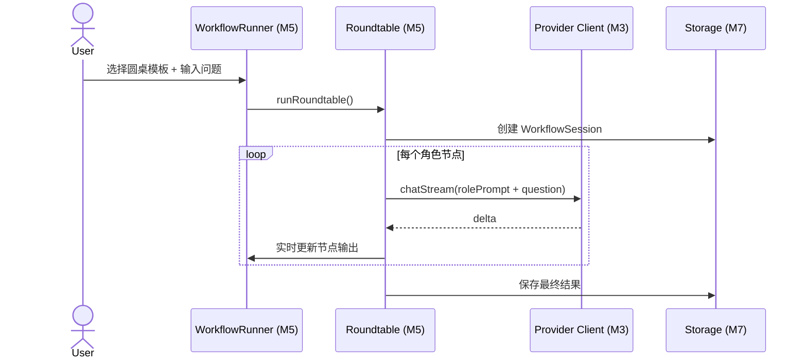

# M5 高阶 AI 工作流（Advanced Workflows）详细设计

> **版本**：v1.0
> **对应 PRD**：第二章「模块 3：高阶 AI 工作流」
> **设计原则**：工作流是对 M3/M4 的编排层，不直接实现 LLM 调用；Roundtable 与 Relay Chain 作为独立会话模式运行，便于测试与扩展。

---

## 1. 设计目标

- 实现「多角色圆桌讨论（Roundtable）」：将不同 Role Prompt 注入各模型 System Payload 并发执行。
- 实现「模型接力链（Relay Chain）」：配置串行流水线，上游输出自动拼接到下游请求。
- 工作流会话与普通聊天会话隔离，但共享数据模型与存储层。
- 支持工作流模板配置与保存。

---

## 2. 职责边界

| 职责 | 属于本模块 | 不属于本模块 |
|---|---|---|
| Roundtable 编排 | ✅ |  |
| Relay Chain 编排 | ✅ |  |
| 工作流模板管理 | ✅ |  |
| 工作流会话状态机 | ✅ |  |
| LLM 实际请求 |  | M3 |
| 通用聊天 UI |  | M4 |
| 数据持久化 |  | M7 |

---

## 3. 核心数据结构

### 3.1 工作流会话

```ts
// modules/workflow/types.ts
export interface WorkflowSession {
  id: string;
  type: 'roundtable' | 'relay';
  title: string;
  createdAt: number;
  updatedAt: number;
  /** 关联的原始上下文 */
  contextId: string | null;
  /** 参与节点 */
  nodes: WorkflowNode[];
  /** 当前执行状态 */
  status: 'idle' | 'running' | 'paused' | 'done' | 'error';
}
```

### 3.2 工作流节点

```ts
export interface WorkflowNode {
  id: string;
  /** 节点顺序（Relay Chain 用） */
  order: number;
  /** 节点名称 */
  name: string;
  /** 使用的 Provider ID */
  providerId: string;
  /** 角色/系统提示词 */
  systemPrompt: string;
  /** 上游节点 ID 列表（Relay Chain 用） */
  upstreamNodeIds: string[];
  /** 节点输出 */
  output?: string;
  /** 节点状态 */
  status: 'pending' | 'running' | 'done' | 'error';
  /** 错误信息 */
  error?: { code: string; message: string };
}
```

### 3.3 工作流模板

```ts
export interface WorkflowTemplate {
  id: string;
  name: string;
  type: 'roundtable' | 'relay';
  description?: string;
  nodes: Omit<WorkflowNode, 'output' | 'status' | 'error'>[];
}
```

---

## 4. Roundtable（圆桌讨论）

### 4.1 概念

- 用户设定多个角色（如「红方挑刺」、「蓝方辩护」）。
- 每个角色对应一个模型节点。
- 系统对同一个用户问题，将不同 Role Prompt 注入各模型后并发执行。
- 结果以并排方式展示，支持角色间观点对比。

### 4.2 执行流程

```ts
// modules/workflow/roundtable.ts
export async function runRoundtable(
  session: WorkflowSession,
  userQuestion: string,
  context: ExtractedContext | null,
  callbacks: WorkflowCallbacks
): Promise<void> {
  const systemPrefix = buildContextPrefix(context);

  await Promise.all(
    session.nodes.map(async (node) => {
      node.status = 'running';
      callbacks.onNodeStatus(node.id, 'running');

      const provider = createProvider(getProviderConfig(node.providerId));
      const request: ChatRequest = {
        providerId: node.providerId,
        systemPrompt: `${systemPrefix}\n\n${node.systemPrompt}`,
        messages: [{ role: 'user', content: userQuestion }],
      };

      let output = '';
      await provider.chatStream(request, (event) => {
        if (event.type === 'delta') {
          output += event.content;
          callbacks.onNodeDelta(node.id, event.content);
        }
      });

      node.output = output;
      node.status = 'done';
      callbacks.onNodeStatus(node.id, 'done');
    })
  );
}
```

---

## 5. Relay Chain（模型接力链）

### 5.1 概念

- 用户配置多个节点形成串行流水线。
- 上游节点输出自动拼接为下游请求的用户消息或 system prompt。
- 支持线性链，也支持简单的 DAG（一个节点可依赖多个上游）。

### 5.2 执行流程

```ts
// modules/workflow/relay.ts
export async function runRelayChain(
  session: WorkflowSession,
  initialInput: string,
  context: ExtractedContext | null,
  callbacks: WorkflowCallbacks
): Promise<void> {
  const sortedNodes = topologicalSort(session.nodes);
  const outputs = new Map<string, string>();

  for (const node of sortedNodes) {
    node.status = 'running';
    callbacks.onNodeStatus(node.id, 'running');

    const input = buildNodeInput(node, initialInput, outputs, context);
    const provider = createProvider(getProviderConfig(node.providerId));

    let output = '';
    await provider.chatStream(
      {
        providerId: node.providerId,
        systemPrompt: node.systemPrompt,
        messages: [{ role: 'user', content: input }],
      },
      (event) => {
        if (event.type === 'delta') {
          output += event.content;
          callbacks.onNodeDelta(node.id, event.content);
        }
      }
    );

    outputs.set(node.id, output);
    node.output = output;
    node.status = 'done';
    callbacks.onNodeStatus(node.id, 'done');
  }
}
```

### 5.3 节点输入构建

```ts
function buildNodeInput(
  node: WorkflowNode,
  initialInput: string,
  upstreamOutputs: Map<string, string>,
  context: ExtractedContext | null
): string {
  const parts: string[] = [];
  if (context) parts.push(`[Context]\n${context.content}`);
  parts.push(`[Original Input]\n${initialInput}`);

  for (const upstreamId of node.upstreamNodeIds) {
    const upstream = upstreamOutputs.get(upstreamId);
    if (upstream) {
      parts.push(`[Output from ${upstreamId}]\n${upstream}`);
    }
  }

  return parts.join('\n\n---\n\n');
}
```

---

## 6. 与 M4 的关系

- 工作流会话复用 M4 的 `Conversation`/`Message` 数据模型，但 `mode` 字段标记为 `roundtable` 或 `relay`。
- 工作流执行器只负责编排，UI 渲染复用 M4 的 `ModelGrid`/`ModelCard` 组件。
- 工作流模板保存在 M7 中，用户可在 Options 中配置。

---

## 7. 组件拆分

```
components/workflow/
├── WorkflowLauncher.vue    # 启动工作流入口
├── RoundtablePanel.vue     # 圆桌讨论配置与执行
├── RelayChainPanel.vue     # 接力链配置与执行
├── NodeEditor.vue          # 节点编辑（角色/模型/上游）
├── WorkflowTemplateList.vue# 模板列表
├── WorkflowRunner.vue      # 执行状态监控
└── WorkflowResultView.vue  # 结果展示（复用 M4 ModelCard）
```

---

## 8. 关键流程

### 8.1 圆桌讨论执行



---

## 9. 错误处理

| 错误场景 | 处理策略 |
|---|---|
| 节点配置缺失 Provider | 标记节点 `error`，提示用户配置 |
| 单节点失败 | Roundtable 中不影响其他节点；Relay Chain 中止后续节点 |
| 循环依赖 | 拓扑排序时检测并报错 |
| 模板解析错误 | 保存时校验，拒绝非法模板 |

---

## 10. 测试策略

- **单元测试**：
  - 拓扑排序与循环依赖检测。
  - Roundtable 多角色 prompt 注入正确性。
  - Relay Chain 输入拼接格式。
- **集成测试**：
  - 用 mock Provider 验证完整 Roundtable 与 Relay Chain。
- **回归测试**：
  - 工作流结果应能正确保存为 M4 兼容的 Conversation。

---

## 11. 依赖契约

| 依赖模块 | 契约 |
|---|---|
| M3 Provider & LLM Client | 通过 `createProvider` 与 `chatStream` 执行各节点 |
| M4 Chat Workspace | 复用 `Conversation`/`Message` 模型与 UI 组件 |
| M7 Storage & Data | 保存 WorkflowSession、Template 与执行结果 |
| M2 Context Extraction | 读取 `currentContext` 作为工作流上下文 |
