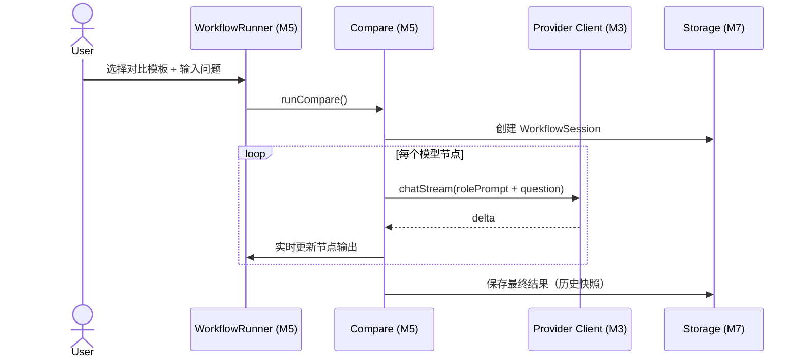
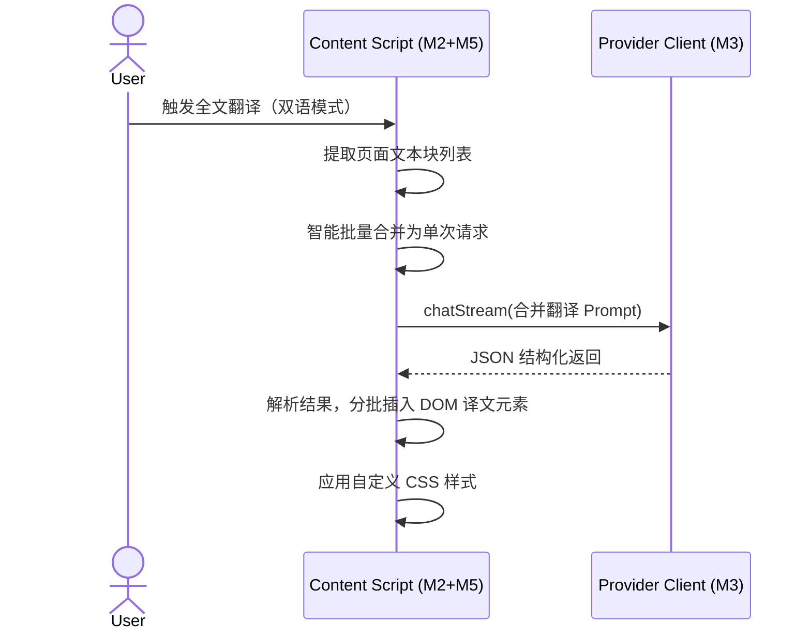

# M5 高阶 AI 工作流（Advanced Workflows）详细设计

> **版本**：v1.1
> **对应 PRD**：v3.2 第二章「模块 3：高阶 AI 工作流」
> **设计原则**：工作流是对 M3/M4 的编排层，不直接实现 LLM 调用；所有工作流模式（多模型并排对比、接力链、解释器、翻译/润色/总结、语音朗读）作为独立会话模式运行，便于测试与扩展。

---

## Coverage Status

> 基于 `/reference/nextai-translator` 与 `/reference/obsidian-clipper` 源码分析。

| 需求项 | 覆盖状态 | 参考实现 | 备注 |
|--------|---------|---------|------|
| 多模型并排对比（Multi-Model Compare） | **未覆盖** | — | EasyChat 并发广播模式为参考，两个项目均无 |
| 模型接力链（Relay Chain） | **未覆盖** | — | 两个项目均无串行流水线 |
| AI 页面解释器（Interpreter） | **部分覆盖** | obsidian-clipper | Interpreter 单次问答 + 批量 Prompt 模式可参考 |
| 翻译 / 润色 / 总结三合一 | **部分覆盖** | nextai-translator | `TranslateMode` 设计（6 种模式），`langCode2TTSLang` 映射表 |
| 沉浸式双语翻译 | **未覆盖** | Read Frog | 内联翻译 + 智能批合并 |
| 语音朗读（TTS） | **部分覆盖** | nextai-translator | `tts/edge-tts` 模块，EdgeTTS 30+ 语言 |
| 工作流模板配置与保存 | **部分覆盖** | nextai-translator | `Action` 系统支持用户自定义 Prompt + 6 种内置模式 |

**综合评估**：Roundtable（并排对比）与 Relay Chain 无任何参考实现，需从零设计编排引擎。翻译/润色/总结和 TTS 可借鉴 nextai-translator 的成熟设计。

**优先级建议**：P6 — 完全新开发模块，需等 M3 Provider + M4 Workspace 完成后才能编排多模型。

---

## 1. 设计目标

- 实现「多模型并排对比（Multi-Model Compare）」：用户一次输入，广播给所有勾选的模型纯前端并发执行，结果并排展示，支持拖拽调整 1/2/3/4 栏布局。
- 实现「模型接力链（Relay Chain）」：两种轻量形式——追问接力（UI 交互便利）和串行对比（Promise 链串接），纯前端实现，不引入工作流引擎。
- 实现「AI 页面解释器（Interpreter）」：轻量级单次问答模式，支持批量 Prompt + JSON 结构化返回 + Filter 后处理。
- 实现「翻译 / 润色 / 总结三合一」：翻译（55+ 语言，沉浸式双语）、润色（语法/风格/学术）、总结（段落/要点/表格/思维导图大纲）、Big-Bang 组合模式。
- 实现「语音朗读（TTS）」：EdgeTTS 集成，选中文本右键朗读、模型输出一键朗读。
- 工作流会话与普通聊天会话隔离，但共享数据模型与存储层。

---

## 2. 职责边界

| 职责 | 属于本模块 | 不属于本模块 |
|---|---|---|
| 多模型并排对比编排 | ✅ |  |
| Relay Chain 编排（追问接力 + 串行对比） | ✅ |  |
| AI 页面解释器（Interpreter） | ✅ |  |
| 翻译 / 润色 / 总结 / Big-Bang | ✅ |  |
| 沉浸式双语翻译（DOM 注入） | ✅ |  |
| 语音朗读（TTS） | ✅ |  |
| 工作流模板管理 | ✅ |  |
| LLM 实际请求 |  | M3 |
| 通用聊天 UI |  | M4 |
| 数据持久化 |  | M7 |

---

## 3. 核心数据结构

### 3.1 工作流会话

```ts
// modules/workflow/types.ts
export interface WorkflowSession {
  id: string;
  type: 'compare' | 'relay' | 'interpreter' | 'translate' | 'polish' | 'summarize' | 'big-bang';
  title: string;
  createdAt: number;
  updatedAt: number;
  /** 关联的原始上下文 */
  contextId: string | null;
  /** 工作流配置 */
  config: WorkflowConfig;
  /** 参与节点（compare / relay 模式使用） */
  nodes?: WorkflowNode[];
  /** 当前执行状态 */
  status: 'idle' | 'running' | 'paused' | 'done' | 'error';
}

export interface WorkflowConfig {
  /** 翻译：源语言/目标语言 */
  sourceLang?: string;
  targetLang?: string;
  /** 翻译：沉浸式双语开关 */
  bilingual?: boolean;
  /** 总结：输出格式 */
  summaryFormat?: 'paragraph' | 'bullet' | 'table' | 'mindmap';
  /** Big-Bang：组合指令列表 */
  bigBangActions?: string[];
}
```

### 3.2 工作流节点（compare / relay 模式）

```ts
export interface WorkflowNode {
  id: string;
  /** 节点顺序（Relay Chain 用） */
  order: number;
  /** 节点名称 */
  name: string;
  /** 使用的 Provider ID */
  providerId: string;
  /** 角色/系统提示词 */
  systemPrompt: string;
  /** 上游节点 ID 列表（Relay Chain 用） */
  upstreamNodeIds: string[];
  /** 节点输出 */
  output?: string;
  /** 节点状态 */
  status: 'pending' | 'running' | 'done' | 'error';
  /** 错误信息 */
  error?: { code: string; message: string };
}
```

### 3.3 工作流模板

```ts
export interface WorkflowTemplate {
  id: string;
  name: string;
  type: WorkflowSession['type'];
  description?: string;
  config: WorkflowConfig;
  nodes?: Omit<WorkflowNode, 'output' | 'status' | 'error'>[];
}
```

---

## 4. 多模型并排对比（Multi-Model Compare）

PRD v3.2 定义为：用户一次输入，广播给所有勾选的模型纯前端并发执行，每个模型卡片独立 System Prompt，结果并排展示。

### 4.1 概念

- 借鉴 EasyChat 并发广播模式：几个模型就发几个并发 API 请求，无后端依赖。
- 每个模型卡片独立配置 System Prompt，实现不同"角色视角"（如红方挑刺 / 蓝方辩护）。
- 支持拖拽调整 1/2/3/4 栏布局。
- 每个卡片独立操作：单独重试、中止、复制、追问。
- 对话可保存为只读"历史快照"，方便回溯对比。

### 4.2 执行流程

```ts
// modules/workflow/compare.ts
export async function runCompare(
  session: WorkflowSession,
  userQuestion: string,
  context: ExtractedContext | null,
  callbacks: WorkflowCallbacks
): Promise<void> {
  const systemPrefix = buildContextPrefix(context);

  await Promise.all(
    session.nodes!.map(async (node) => {
      node.status = 'running';
      callbacks.onNodeStatus(node.id, 'running');

      const provider = createProvider(getProviderConfig(node.providerId));
      const request: ChatRequest = {
        providerId: node.providerId,
        systemPrompt: `${systemPrefix}\n\n${node.systemPrompt}`,
        messages: [{ role: 'user', content: userQuestion }],
      };

      let output = '';
      await provider.chatStream(request, (event) => {
        if (event.type === 'delta') {
          output += event.content;
          callbacks.onNodeDelta(node.id, event.content);
        }
      });

      node.output = output;
      node.status = 'done';
      callbacks.onNodeStatus(node.id, 'done');
    })
  );
}
```

---

## 5. Relay Chain（模型接力链）

PRD v3.2 定义两种轻量形式，纯前端 Promise 链串接，不引入工作流引擎。

### 5.1 形式 A — 追问接力

- 点击某模型卡片底部的「以此继续」，将该模型输出作为新对话上下文，切换到另一个模型继续提问。
- 这是 UI 交互便利，无自动管线。由 M4 的分支追问机制实现。

### 5.2 形式 B — 串行对比

- 配置 2 个模型串行执行：先跑 A 模型，A 完成后自动触发 B 模型。
- B 模型收到 A 完整输出作为额外上下文。
- 前端用 `Promise` 链串起两段异步调用即可。

```ts
// modules/workflow/relay.ts
export async function runSerialCompare(
  session: WorkflowSession,
  initialInput: string,
  context: ExtractedContext | null,
  callbacks: WorkflowCallbacks
): Promise<void> {
  const sortedNodes = topologicalSort(session.nodes!);
  const outputs = new Map<string, string>();

  for (const node of sortedNodes) {
    node.status = 'running';
    callbacks.onNodeStatus(node.id, 'running');

    const input = buildNodeInput(node, initialInput, outputs, context);
    const provider = createProvider(getProviderConfig(node.providerId));

    let output = '';
    await provider.chatStream(
      {
        providerId: node.providerId,
        systemPrompt: node.systemPrompt,
        messages: [{ role: 'user', content: input }],
      },
      (event) => {
        if (event.type === 'delta') {
          output += event.content;
          callbacks.onNodeDelta(node.id, event.content);
        }
      }
    );

    outputs.set(node.id, output);
    node.output = output;
    node.status = 'done';
    callbacks.onNodeStatus(node.id, 'done');
  }
}

function buildNodeInput(
  node: WorkflowNode,
  initialInput: string,
  upstreamOutputs: Map<string, string>,
  context: ExtractedContext | null
): string {
  const parts: string[] = [];
  if (context) parts.push(`[Context]\n${context.content}`);
  parts.push(`[Original Input]\n${initialInput}`);

  for (const upstreamId of node.upstreamNodeIds) {
    const upstream = upstreamOutputs.get(upstreamId);
    if (upstream) {
      parts.push(`[Output from ${upstreamId}]\n${upstream}`);
    }
  }

  return parts.join('\n\n---\n\n');
}
```

---

## 6. AI 页面解释器（Interpreter）

借鉴 obsidian-clipper Interpreter 模式，面向单次问答而非持续对话。

### 6.1 概念

- 用户定义 Prompt 变量（如 `{{"用三句话总结这篇文章"}}`、`{{"提取文中的所有人名和地名"}}`）。
- 系统将页面上下文 + Prompt 变量打包为单次 API 请求。
- 支持批量 Prompt：一次请求同时处理多个 Prompt，模型以 JSON 格式返回结果并自动回填到模板对应位置。
- Prompt 输出同样支持 Filter 管道后处理（复用 M4 的 Filter 系统）。

### 6.2 执行流程

```ts
// modules/workflow/interpreter.ts
export async function runInterpreter(
  session: WorkflowSession,
  prompts: string[],
  context: ExtractedContext | null,
  providerConfig: ProviderConfig
): Promise<Record<string, string>> {
  const provider = createProvider(providerConfig);

  // 批量 Prompt 打包为 JSON 请求
  const batchPrompt = prompts
    .map((p, i) => `Prompt ${i + 1}: ${p}`)
    .join('\n\n');

  const systemPrompt = `请按 JSON 格式返回结果：{"prompt_1": "...", "prompt_2": "..."}。\n\n上下文：${context?.content || ''}`;

  let output = '';
  await provider.chatStream(
    {
      providerId: providerConfig.id,
      systemPrompt,
      messages: [{ role: 'user', content: batchPrompt }],
    },
    (event) => {
      if (event.type === 'delta') output += event.content;
    }
  );

  // 解析 JSON 结果
  try {
    return JSON.parse(output);
  } catch {
    // 降级：整体返回
    return { result: output };
  }
}
```

---

## 7. 翻译 / 润色 / 总结三合一

借鉴 nextai-translator 的 `TranslateMode` 设计（`translate` / `polishing` / `summarize` / `analyze` / `explain-code` / `big-bang`）和 Read Frog 的沉浸式双语翻译。

### 7.1 翻译模式

- 支持 55+ 语言互译，带语言自动检测与 Quote 智能处理。
- **沉浸式双语翻译（借鉴 Read Frog）**：
  - 在网页原文元素旁直接显示译文，保留原始排版布局。
  - 支持双语对照 / 仅译文两种模式切换。
  - 通过自定义 CSS 调整翻译文本的颜色、字体、边框等样式。
  - 翻译结果分批插入 DOM，不阻塞页面渲染。
- **智能批量请求合并（借鉴 Read Frog）**：
  - 全文翻译场景下，将页面内多个翻译块合并为单次 API 请求。
  - 通过 Prompt 拼接 + JSON 结构化返回一次性获取所有翻译结果。
  - API 调用成本最高可节省 70%。同样适用于批量划词解释场景。

### 7.2 润色模式

- 语法修正：纠正拼写、时态、标点。
- 风格优化：正式 / 口语 / 学术 / 商务等风格切换。
- 学术写作辅助：学术化措辞、引用格式规范。

### 7.3 总结模式

- 可指定输出格式：
  - **段落**：自然语言段落总结。
  - **要点**：Bullet Points 列表。
  - **表格**：结构化对比/分类表格。
  - **思维导图大纲**：Markdown 层级大纲，可导入思维导图工具。

### 7.4 Big-Bang 模式

- 用户自定义组合指令，一并发起翻译 + 总结 + 分析。
- 各子任务并发执行，结果按模块展示。

---

## 8. 语音朗读（TTS）

借鉴 nextai-translator 的 `tts/edge-tts` 模块。

### 8.1 集成方案

- 使用 EdgeTTS（通过浏览器原生 Web Speech API 或 Edge TTS 接口），零额外依赖。
- 支持 30+ 语言语音朗读。
- 语言-语音自动映射（`langCode2TTSLang` 映射表）。

### 8.2 触发方式

- **选中文本右键 → 朗读**：通过 M2 的右键菜单集成触发。
- **侧边栏内模型输出一键朗读**：模型输出卡片底部增加「朗读」按钮。

### 8.3 实现

```ts
// modules/workflow/tts.ts
export function speak(text: string, lang: string): void {
  const utterance = new SpeechSynthesisUtterance(text);
  utterance.lang = langCode2TTSLang(lang);
  utterance.rate = 1.0;
  speechSynthesis.speak(utterance);
}

// 语言映射表
const langCode2TTSLang: Record<string, string> = {
  'zh-CN': 'zh-CN',
  'en': 'en-US',
  'ja': 'ja-JP',
  'ko': 'ko-KR',
  // ... 30+ 语言
};
```

---

## 9. 与 M4 的关系

- 工作流会话复用 M4 的 `Conversation`/`Message` 数据模型，但 `mode` 字段标记为对应工作流类型。
- 工作流执行器只负责编排，UI 渲染复用 M4 的 `ModelGrid`/`ModelCard` 组件。
- 沉浸式双语翻译的 DOM 注入由 content script 直接操作，不经过 Side Panel。
- 工作流模板保存在 M7 中，用户可在 Options 中配置。

---

## 10. 组件拆分

```
components/workflow/
├── WorkflowLauncher.vue       # 启动工作流入口
├── ComparePanel.vue           # 多模型并排对比配置与执行
├── RelayChainPanel.vue        # 接力链配置与执行
├── InterpreterPanel.vue       # 解释器 Prompt 定义与执行
├── TranslatePanel.vue         # 翻译 / 润色 / 总结配置
├── TTSControls.vue            # 语音朗读控制
├── NodeEditor.vue             # 节点编辑（角色/模型/上游）
├── WorkflowTemplateList.vue   # 模板列表
├── WorkflowRunner.vue         # 执行状态监控
└── WorkflowResultView.vue     # 结果展示（复用 M4 ModelCard）
```

---

## 11. 关键流程

### 11.1 多模型并排对比执行



### 11.2 沉浸式翻译



---

## 12. 错误处理

| 错误场景 | 处理策略 |
|---|---|
| 节点配置缺失 Provider | 标记节点 `error`，提示用户配置 |
| 单节点失败 | 并排对比中不影响其他节点；Relay Chain 中止后续节点 |
| 循环依赖 | 拓扑排序时检测并报错 |
| 模板解析错误 | 保存时校验，拒绝非法模板 |
| 翻译语言不支持 | 降级为自动检测 → 英语 |
| TTS 不可用（浏览器限制） | 提示用户检查浏览器语音权限 |

---

## 13. 测试策略

- **单元测试**：
  - 拓扑排序与循环依赖检测。
  - 并排对比多角色 prompt 注入正确性。
  - Relay Chain 输入拼接格式。
  - Interpreter 批量 Prompt JSON 解析。
  - 语言映射表完整性。
- **集成测试**：
  - 用 mock Provider 验证完整并排对比与 Relay Chain。
  - 沉浸式翻译的 DOM 注入与样式隔离。
  - TTS 语音合成触发。
- **回归测试**：
  - 工作流结果应能正确保存为 M4 兼容的 Conversation。

---

## 14. 依赖契约

| 依赖模块 | 契约 |
|---|---|
| M3 Provider & LLM Client | 通过 `createProvider` 与 `chatStream` 执行各节点 |
| M4 Chat Workspace | 复用 `Conversation`/`Message` 模型与 UI 组件；复用 Filter 管道 |
| M7 Storage & Data | 保存 WorkflowSession、Template 与执行结果 |
| M2 Context Extraction | 读取 `currentContext` 作为工作流上下文；沉浸式翻译复用 content script |
