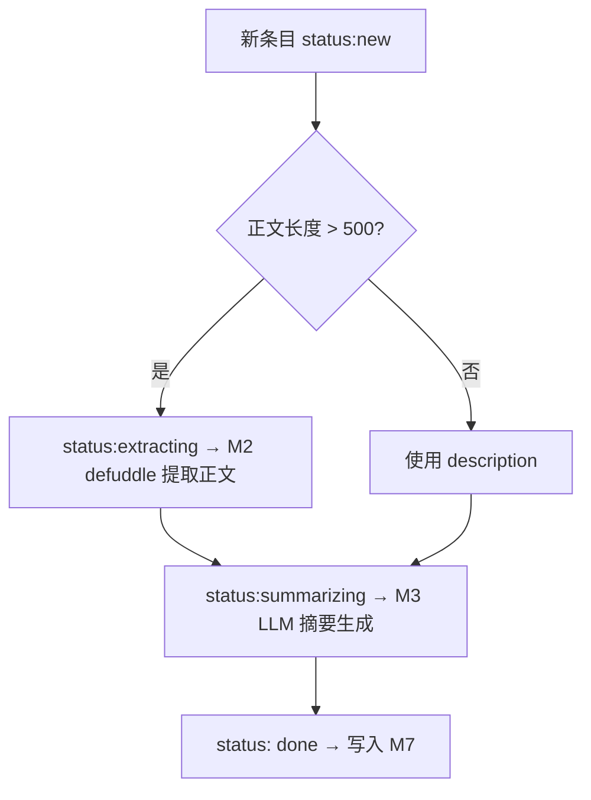
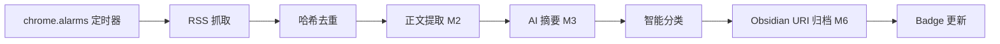

# M8 后台 RSS 自动化流水线（RSS Pipeline）详细设计

> **版本**：v1.1
> **对应 PRD**：v3.2 第二章「模块 5：后台 RSS 自动化流水线」
> **设计原则**：RSS 流水线是全后台非阻塞流程，不打开 tab、不影响前台浏览；提取、AI 摘要、分类、归档全部静默执行。

---

## Coverage Status

> 基于 `/reference/obsidian-clipper` 与 `/reference/nextai-translator` 源码分析。

| 需求项 | 覆盖状态 | 参考实现 | 备注 |
|--------|---------|---------|------|
| 定时后台 RSS 抓取 | **已覆盖** | obsidian-clipper | `chrome.alarms` + `fetch XML` 模式可复用 |
| 哈希去重 | **已覆盖** | obsidian-clipper | `buildContentHash()` 函数 + IndexedDB contentHash 索引 |
| AI 预处理摘要 | **已覆盖** | obsidian-clipper (Interpreter) | 单次问答模式，用 defuddle 正文 + 自定义 Prompt |
| 智能分类与归档 | **已覆盖** | obsidian-clipper | 模板触发规则系统（URL 匹配 / Schema.org 类型 / 正则） |
| Badge 更新 | **未覆盖** | — | 两个项目均不涉及浏览器扩展 badge |

**综合评估**：RSS 抓取、去重、AI 摘要、智能分类均可复用 obsidian-clipper 的成熟方案。Badge 更新为新增需求。

**优先级建议**：P7 — 依赖 M2 提取器 + M3 Provider Client + M6 Obsidian URI，是最后一块拼图。

---

## 1. 设计目标

- 后台定时（可配置，默认 30 分钟）抓取用户订阅的 RSS 源，静默获取新内容。
- 哈希去重：`标题 + 链接 + 发布时间` 组合哈希，避免重复处理。
- AI 预处理摘要（3-5 句要点提炼 + 新增信息 + 关键词标签）。
- 智能分类与归档：借鉴 obsidian-clipper 模板触发规则，按站点/Schema.org 类型自动匹配模板生成统一格式笔记，写入 Obsidian。
- 扩展图标 badge 显示未读订阅数 + 新文章数。

---

## 2. 职责边界

| 职责 | 属于本模块 | 不属于本模块 |
|---|---|---|
| RSS XML 抓取与解析 | ✅ |  |
| 哈希去重 | ✅ |  |
| AI 摘要触发 | ✅ |  |
| 智能分类与归档 | ✅ |  |
| Badge 图标更新 | ✅ |  |
| RSS 订阅管理 UI | ✅ |  |
| DOM 正文提取 |  | M2 |
| LLM API 请求 |  | M3 |
| Obsidian URI 写入 |  | M6 |

---

## 3. 核心数据结构

### 3.1 RSS 源配置

```ts
// modules/rss/types.ts
export interface RssFeed {
  id: string;
  name: string;
  url: string;
  /** 抓取间隔（分钟），默认 30 */
  intervalMinutes: number;
  /** 是否启用 */
  enabled: boolean;
  /** 上次抓取时间戳 */
  lastFetchedAt?: number;
  /** 关联的分类归档模板 ID */
  archiveTemplateId?: string;
  /** Schema.org 类型（用于智能分类） */
  schemaType?: string;
}
```

### 3.2 RSS 条目

```ts
export interface RssItem {
  id: string; // guid 或 链接的哈希
  feedId: string;
  title: string;
  link: string;
  description?: string;
  publishedAt: number;
  /** content:encoded 的原文 */
  contentEncoded?: string;
  /** 内容哈希（用于去重） */
  contentHash: string;
  /** AI 预处理结果（若已处理） */
  aiSummary?: AiSummaryResult;
  /** 处理状态 */
  status: 'new' | 'extracting' | 'summarizing' | 'archiving' | 'done' | 'error';
  /** 归档结果 */
  archiveResult?: ArchiveResult;
}

export interface AiSummaryResult {
  /** 3-5 句要点 */
  keyPoints: string[];
  /** 相比往期的增量/变化 */
  newInfo: string;
  /** 关键词标签 */
  tags: string[];
  /** 生成时间 */
  generatedAt: number;
}
```

### 3.3 归档规则

```ts
export interface ArchiveRule {
  id: string;
  name: string;
  /** 匹配规则 */
  trigger: TriggerRule;
  /** 归档模板（使用 M4 模板变量系统） */
  template: PromptTemplate;
}
```

### 3.4 哈希去重

```ts
// modules/rss/dedup.ts
export function buildContentHash(item: { title: string; link: string; publishedAt: number }): string {
  const input = `${item.title}|${item.link}|${item.publishedAt}`;
  // 简单哈希（MV3 限制下不使用 crypto.subtle）
  return simpleHash(input);
}
```

---

## 4. RSS 抓取

### 4.1 定时器

- 使用 `chrome.alarms` API 创建定时任务。
- 最小间隔 15 分钟（MV3 Service Worker 生命周期兼容）。
- 用户可自定义间隔，默认 30 分钟。

### 4.2 抓取器

```ts
// modules/rss/fetcher.ts
export async function fetchFeed(feed: RssFeed): Promise<RssItem[]> {
  const response = await fetch(feed.url);
  const xml = await response.text();
  const parsed = parseRssXml(xml);

  const items: RssItem[] = [];
  for (const entry of parsed.items) {
    const contentHash = buildContentHash({
      title: entry.title,
      link: entry.link,
      publishedAt: entry.publishedAt,
    });

    // 去重检查
    const exists = await isDuplicate(feed.id, contentHash);
    if (exists) continue;

    items.push({
      id: entry.guid || contentHash,
      feedId: feed.id,
      title: entry.title,
      link: entry.link,
      description: entry.description,
      publishedAt: entry.publishedAt,
      contentEncoded: entry.contentEncoded,
      contentHash,
      status: 'new',
    });
  }

  return items;
}
```

---

## 5. AI 预处理摘要

### 5.1 流程



### 5.2 摘要 Prompt

```ts
const SUMMARY_PROMPT = `
请用中文总结以下 RSS 文章，格式要求：
1. 3-5 句核心要点（每句不超过 50 字）
2. 相比往期的新增信息或变化（若无则写「无新增」）
3. 3-5 个关键词标签（用英文逗号分隔）

原文：
---
{{content}}
---
`;
```

### 5.3 速率限制

- RSS 摘要请求不影响前台用户交互（使用独立 API Key 或低优先级策略）。
- 单次批量最多处理 5 篇，批次间间隔 10 秒。
- 429 限流时自动退避，与 M3 错误处理一致。

---

## 6. 智能分类与归档

借鉴 obsidian-clipper 的模板触发规则系统，对 RSS 内容按站点/Schema.org 类型自动匹配模板生成统一格式笔记。

### 6.1 分类规则

| 匹配维度 | 示例规则 | 归档行为 |
|----------|----------|----------|
| **域名匹配** | `github.com` | 归档到 `技术/GitHub/`，模板含 repo 链接、star 数占位 |
| **域名 + 路径前缀** | `arxiv.org/abs/` | 归档到 `论文/Arxiv/`，模板含 标题 + 摘要 + arXiv ID |
| **Schema.org 类型** | `@Article` | 归档到 `阅读/文章/`，模板含 作者 + 发布日期 + 标签 |
| **Schema.org 类型** | `@Recipe` | 归档到 `生活/食谱/`，模板含 食材 + 步骤 |
| **URL 正则** | `*.github.com/*/releases/*` | 归档到 `技术/Release Notes/`，模板含版本号 + 变更日志 |

### 6.2 归档模板

```markdown
---
title: "{{title}}"
source: "{{link}}"
date: {{published}}
tags: [{{tags}}]
site: "{{siteName}}"
---

# {{title}}

> 原文链接：{{link}}

## AI 摘要

- {{point}}



## 新增/变化
{{newInfo}}


## 原文
{{content}}
```

### 6.3 归档执行

- 摘要生成后，根据匹配的归档规则调用 M6 的 Obsidian URI 直写接口。
- 写入目标：`<vault>/RSS/<分类文件夹>/<发布日期>_<标题>.md`。
- 支持「递归日报」模式：每日同一源的多篇文章合并为单篇日报笔记。

---

## 7. Badge 更新

```ts
// modules/rss/badge.ts
export function updateBadge(
  unreadCount: number,
  newCount: number
): void {
  if (unreadCount > 0) {
    chrome.action.setBadgeText({ text: unreadCount.toString() });
    chrome.action.setBadgeBackgroundColor({
      color: newCount > 0 ? '#FF5722' : '#1565C0',
    });
  } else {
    chrome.action.setBadgeText({ text: '' });
  }
}
```

- 未读数 = status `new` + `extracting` + `summarizing`。
- 新文章数 = 最近一次用户查看后产生的新条目数。
- 点击扩展图标进入 Side Panel 时清除 badge。

---

## 8. 订阅源管理 UI

- Options 页面中的 RSS 管理页。
- 支持添加/删除/编辑 RSS 源。
- 支持导入 OPML 订阅列表。
- 显示各源的上次抓取时间、条目数、错误状态。
- 配置各源的归档规则（选择模板、分类文件夹）。

---

## 9. 处理流水线



---

## 10. 组件与服务拆分

```
modules/rss/
├── index.ts              # 对外暴露 start/stop/fetchAll
├── types.ts              # 数据类型
├── fetcher.ts            # RSS XML 抓取与解析
├── dedup.ts              # 哈希去重
├── pipeline.ts           # 完整流水线编排
├── summarizer.ts         # AI 预处理摘要
├── classifier.ts         # 智能分类（模板触发规则匹配）
├── archiver.ts           # 归档写入（调用 M6）
├── badge.ts              # Badge 图标更新
├── background.ts         # Service Worker 入口
└── components/
    ├── RssManager.vue    # 订阅源管理
    ├── RssFeedList.vue   # 订阅源列表
    └── RssItemList.vue   # 条目列表
```

---

## 11. 错误处理

| 错误场景 | 处理策略 |
|---|---|
| RSS 源不可达（DNS/超时） | 标记条目 `error`，下次定时重试；连续失败 3 次暂停源并通知用户 |
| XML 解析失败 | 记录错误，跳过本次 |
| 翻墙限制 | 提示用户配置代理或手动添加可访问源 |
| AI 摘要失败 | 条目保持 `extracted` 状态，不阻塞后续条目；下次定时重试 |
| 归档写入失败 | 重试 3 次，仍失败标记 `error` |
| 哈希碰撞 | 极低概率，回退到 `link + publishedAt` 双重校验 |

---

## 12. 测试策略

- **单元测试**：
  - RSS XML 解析（mock XML 数据）。
  - 去重哈希碰撞测试。
  - AI 摘要 Prompt 模板填充。
  - 智能分类规则匹配。
- **集成测试**：
  - 用 mock fetch 模拟 RSS 源返回。
  - 完整流水线（抓取 → 去重 → 摘要 → 分类 → 归档）。
  - badge 更新与清除。
- **Mock 数据**：准备 3 个标准 RSS 源快照用于回归测试。

---

## 13. 依赖契约

| 依赖模块 | 契约 |
|---|---|
| M2 Context Extraction | 提供 defuddle 提取正文 |
| M3 Provider & LLM Client | 提供 `chatStream` 用于 AI 摘要（需独立 API Key 或限流配置） |
| M6 Export & Sync | 通过 Obsidian URI 写入归档笔记 |
| M7 Storage & Data | 持久化 RssFeed 配置、RssItem、摘要结果、contentHash 索引 |
| M4 Chat Workspace | 复用提示词模板变量系统用于归档模板 |
