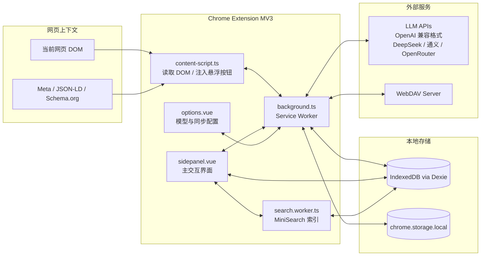
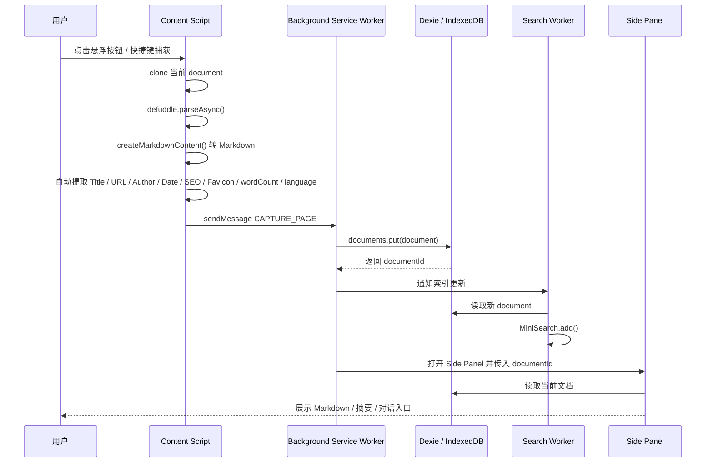
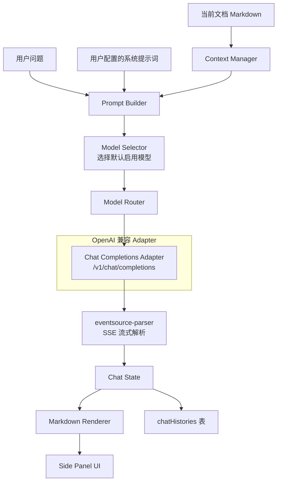
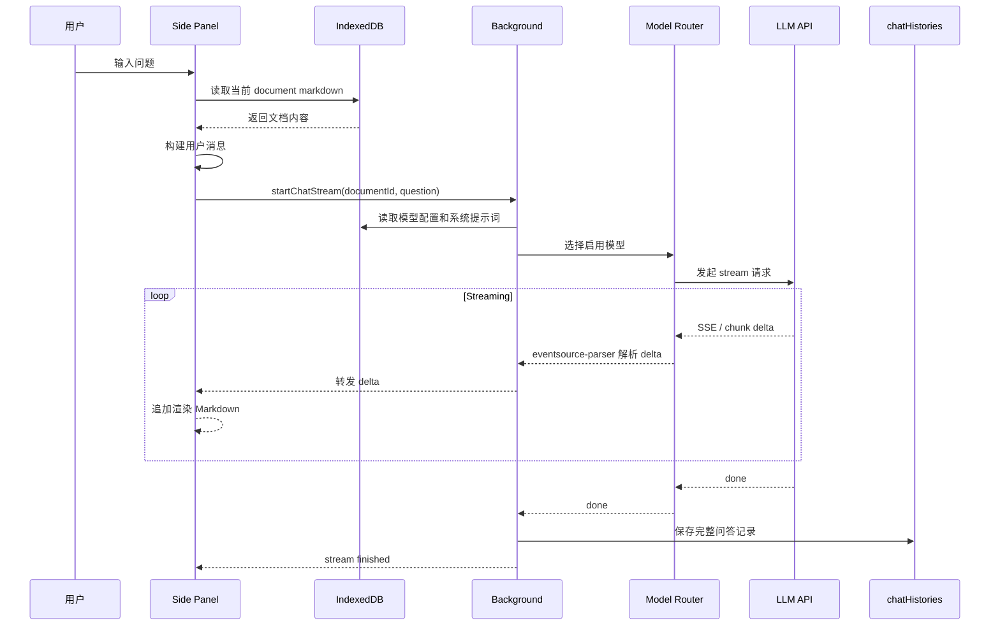
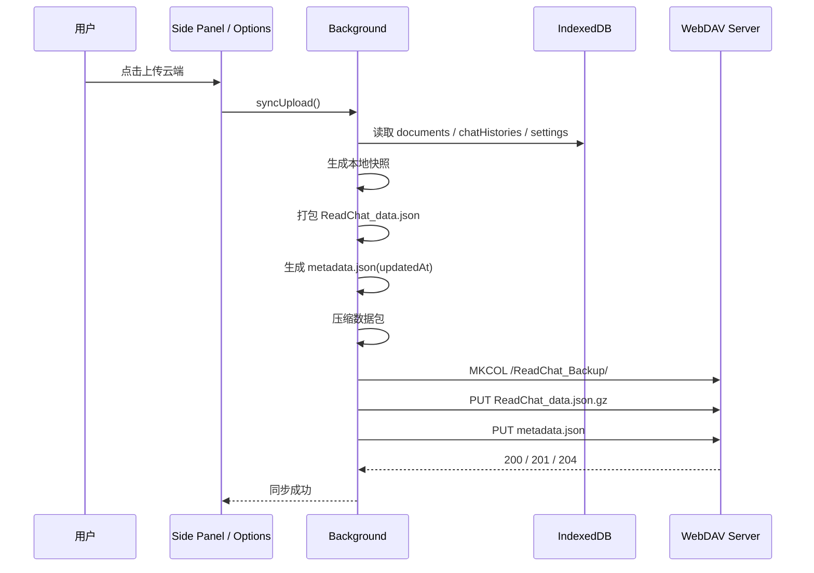
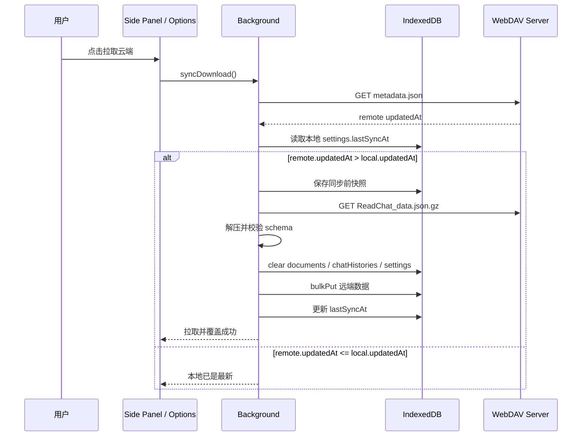
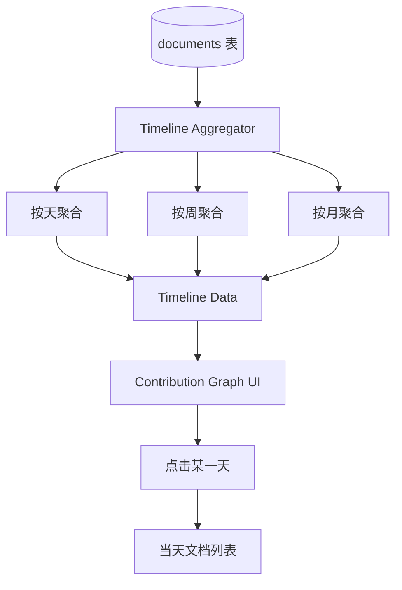
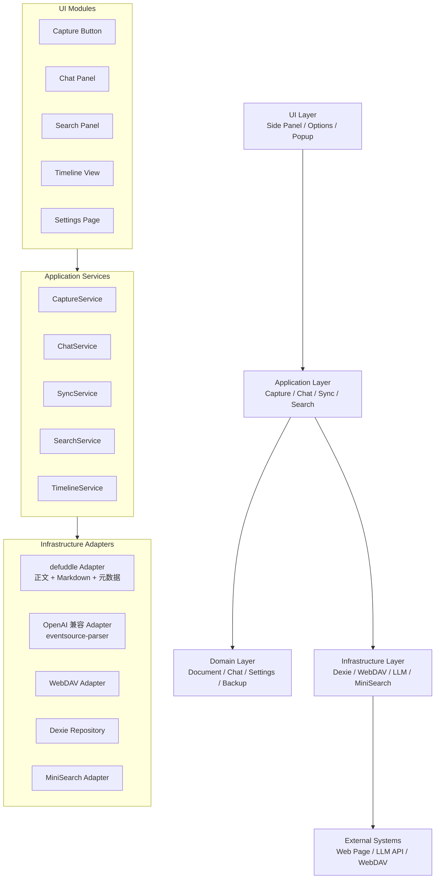
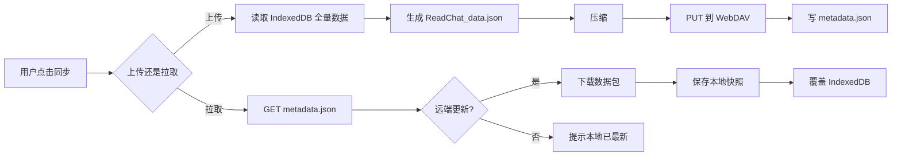

下面是一版 **ReadChat Chrome Extension MV3 详细技术架构图**，按你定义的 4 层架构展开，并补充核心数据流、AI 流式对话、WebDAV 同步、本地检索 Worker 的技术路径。

---

# 1. 总体技术架构图

```mermaid
flowchart TB
  User[用户] --> Browser[Chrome 浏览器]

  Browser --> ContentScript[Content Script<br/>网页 DOM 访问层]
  Browser --> SidePanel[Side Panel UI<br/>沉浸式侧边栏]
  Browser --> Popup[Popup / Floating Button<br/>快捷入口]
  Browser --> Background[MV3 Service Worker<br/>后台调度中心]

  subgraph Perception[捕获层 Perception]
    ContentScript --> DOMReader[DOM 快照读取]
    DOMReader --> defuddle[defuddle<br/>正文抽取 + 元数据 + Markdown]
    defuddle --> CaptureResult[标准化捕获结果<br/>Markdown + Metadata]
  end

  subgraph Thinking[处理层 Thinking]
    SidePanel --> ChatUI[Chat with Doc UI]
    ChatUI --> PromptBuilder[Prompt 构建器<br/>System Prompt + Doc Context + User Question]
    PromptBuilder --> ModelRouter[OpenAI 兼容模型路由器]
    ModelRouter --> OpenAI[OpenAI 兼容 Adapter<br/>Chat Completions API]
    OpenAI --> StreamParser[eventsource-parser<br/>SSE 流式解析]
    StreamParser --> MarkdownRenderer[Markdown 渲染<br/>代码高亮 / 公式]
    MarkdownRenderer --> ChatUI
  end

  subgraph Persistence[记忆层 Persistence]
    Dexie[Dexie.js]
    IndexedDB[(IndexedDB)]
    Documents[(documents)]
    ChatHistories[(chatHistories)]
    Settings[(settings)]
    Dexie --> IndexedDB
    IndexedDB --> Documents
    IndexedDB --> ChatHistories
    IndexedDB --> Settings

    Exporter[手动导出器<br/>ReadChat_backup.json]
    BackupPackager[整包备份打包器<br/>ReadChat_data.json]
    Compressor[压缩模块<br/>CompressionStream('gzip')]
    WebDAVClient[WebDAV Client<br/>PUT / GET / PROPFIND]
    RemoteWebDAV[(WebDAV Server<br/>坚果云 / Nextcloud / NAS)]

    Dexie --> Exporter
    Dexie --> BackupPackager
    BackupPackager --> Compressor
    Compressor --> WebDAVClient
    WebDAVClient --> RemoteWebDAV
  end

  subgraph Awakening[唤醒层 Awakening]
    SearchWorker[Web Worker<br/>MiniSearch Index Worker]
    MiniSearch[MiniSearch Index<br/>title 权重 3<br/>markdownContent 权重 1]
    SearchAPI[Search API]
    Timeline[Timeline Aggregator<br/>day / week / month]
    TimelineUI[历史时间轴 UI<br/>Contribution Graph]

    Documents --> SearchWorker
    SearchWorker --> MiniSearch
    SidePanel --> SearchAPI
    SearchAPI --> MiniSearch

    Documents --> Timeline
    Timeline --> TimelineUI
    TimelineUI --> SidePanel
  end

  CaptureResult --> Background
  Background --> Dexie
  Dexie --> SidePanel
  Popup --> Background
  Background --> SidePanel
```

---

# 2. Chrome Extension 运行时架构



## 关键职责划分

- `content.ts`（WXT entrypoint）
  - 访问当前页面 DOM
  - 执行 defuddle 解析（需 `world: 'MAIN'`，defuddle 需完整 DOM 访问）
  - 提取 metadata（author / published / favicon / image / wordCount / language / schemaOrgData）
  - 触发捕获事件
  - 注入悬浮捕获按钮

- `background.ts`
  - MV3 Service Worker 调度中心
  - 负责跨上下文通信
  - 调用 LLM API
  - 执行 WebDAV 同步
  - 处理右键菜单、快捷键、side panel 打开

- `sidepanel.vue`
  - Chat with Doc 主界面
  - 展示当前文档
  - 展示 AI 流式回复
  - 搜索入口
  - 时间轴入口

- `options.vue`
  - 模型配置
  - API Key 管理
  - Base URL 配置
  - WebDAV 配置
  - 系统提示词配置

- `search.worker.ts`
  - MiniSearch 索引构建
  - 异步增量更新
  - 全文检索响应

---

# 3. 捕获层数据流



## 捕获结果结构

```ts
interface CapturedDocument {
  id: string;
  title: string;
  url: string;
  author?: string;
  publishedAt?: string;
  favicon?: string;
  description?: string;
  keywords?: string[];
  markdownContent: string;
  rawHtml?: string;
  siteName?: string;
  image?: string;
  wordCount?: number;
  language?: string;
  schemaOrgData?: any;        // defuddle 提取的 JSON-LD / Schema.org
  createdAt: number;
  updatedAt: number;
}
```

> **defuddle 用法提示：** `createMarkdownContent` 从 `defuddle/full` 导入（非 `defuddle` 主入口）。

---

# 4. Thinking 层：OpenAI 兼容流式对话架构



## 流式输出格式

统一使用 OpenAI 兼容的 SSE 格式，通过 `eventsource-parser` 解析：

```ts
interface StreamDelta {
  type: 'text' | 'reasoning' | 'tool' | 'done' | 'error';
  content?: string;
  error?: string;
}
```

## 模型配置结构

```ts
interface ModelProviderConfig {
  id: string;
  name: string;
  provider: 'openai-compatible';  // 统一 OpenAI 兼容格式
  enabled: boolean;
  apiKey: string;
  baseUrl: string;                // DeepSeek / 通义 / OpenRouter 等
  model: string;
  systemPrompt?: string;
  createdAt: number;
  updatedAt: number;
}
```

---

# 5. Chat with Doc 流式对话时序图



---

# 6. 记忆层：IndexedDB 数据模型

```mermaid
erDiagram
  documents {
    string id PK
    string title
    string url
    string author
    string publishedAt
    string favicon
    string description
    string markdownContent
    string rawHtml
    number createdAt
    number updatedAt
  }

  chatHistories {
    string id PK
    string documentId FK
    string modelId        # 关联 ModelProviderConfig.id
    string model
    array messages
    number createdAt
    number updatedAt
  }

  settings {
    string key PK
    object value
    number updatedAt
  }

  documents ||--o{ chatHistories : has
```

## Dexie 表建议

```ts
db.version(1).stores({
  documents: 'id, url, title, createdAt, updatedAt',
  chatHistories: 'id, documentId, createdAt, updatedAt',
  settings: 'key, updatedAt'
});
```

---

# 7. WebDAV 整包同步架构

```mermaid
flowchart TB
  subgraph Local[本地]
    DB[(IndexedDB)]
    Snapshot[同步前本地快照]
    Packager[Backup Packager]
    DataJSON[ReadChat_data.json]
    MetadataLocal[metadata.json<br/>updatedAt]
    Compressor[压缩<br/>CompressionStream('gzip')]
  end

  subgraph Remote[WebDAV 远端]
    RemoteDir[/ReadChat_Backup/]
    RemoteData[ReadChat_data.json.gz]
    RemoteMeta[metadata.json]
  end

  DB --> Snapshot
  DB --> Packager
  Packager --> DataJSON
  Packager --> MetadataLocal
  DataJSON --> Compressor
  Compressor --> RemoteData
  MetadataLocal --> RemoteMeta

  RemoteDir --> RemoteData
  RemoteDir --> RemoteMeta
```

## 上传流程



## 拉取流程



## 压缩方案

使用原生 `CompressionStream('gzip')` API（Chrome 80+ 支持，零依赖）：

```ts
async function gzipCompress(data: string): Promise<Blob> {
  const encoder = new TextEncoder();
  const stream = new Blob([encoder.encode(data)])
    .stream()
    .pipeThrough(new CompressionStream('gzip'));
  return new Response(stream).blob();
}
```

备份文件统一命名为 `ReadChat_data.json.gz`。

---

# 8. Awakening 层：MiniSearch 本地检索架构

```mermaid
flowchart TB
  Documents[(documents 表)] --> SearchWorker[search.worker.ts]

  subgraph Startup[启动时：全量重建]
    SearchWorker --> LoadAll[Dexie 读取全部 documents]
    LoadAll --> FullIndex[MiniSearch.addDocuments()]
  end

  subgraph Runtime[运行时：增量更新]
    ChangeNotifier[postMessage 通知] --> SingleOp[addDocument / remove]
    SingleOp --> MiniSearchIndex[MiniSearch Index]
  end

  FullIndex --> MiniSearchIndex

  MiniSearchIndex --> SearchQuery[search(query)]
  SearchQuery --> Ranking[字段权重排序<br/>title x3<br/>markdownContent x1]
  Ranking --> SearchResult[SearchResult[]]

  SidePanel[Side Panel Search UI] --> SearchQuery
  SearchResult --> SidePanel
```

## 索引策略：混合模式

| 阶段 | 策略 | 触发时机 | 性能 |
|------|------|---------|------|
| Worker 启动 | 全量重建 `addDocuments()` | 首次打开 Side Panel / Service Worker 唤醒 | 万级文档 < 1s |
| 运行时 | 增量 `addDocument()` / `remove()` | 捕获新文档 / 删除文档 | < 10ms |

全量重建保证索引一致性（无漂移），增量更新保证运行时响应速度。

## Worker 消息协议

```ts
type SearchWorkerRequest =
  | { type: 'INIT_INDEX' }                              // 启动全量重建
  | { type: 'UPSERT_DOCUMENT'; documentId: string }     // 增量更新单篇
  | { type: 'REMOVE_DOCUMENT'; documentId: string }     // 增量删除单篇
  | { type: 'SEARCH'; query: string; requestId: string };

type SearchWorkerResponse =
  | { type: 'INDEX_READY' }                             // 全量重建完成
  | { type: 'SEARCH_RESULT'; requestId: string; results: SearchResult[] }
  | { type: 'ERROR'; message: string };
```

## MiniSearch 配置建议

```ts
const miniSearch = new MiniSearch({
  fields: ['title', 'markdownContent'],
  storeFields: ['id', 'title', 'url', 'createdAt'],
  searchOptions: {
    boost: {
      title: 3,
      markdownContent: 1
    },
    fuzzy: 0.2,
    prefix: true
  }
});
```

---

# 9. 时间轴 Timeline 架构



## 聚合结果结构

```ts
interface TimelineBucket {
  date: string;
  count: number;
  documentIds: string[];
}

interface TimelineQuery {
  mode: 'day' | 'week' | 'month';
  startAt: number;
  endAt: number;
}
```

---

# 10. 模块依赖关系图



---

# 11. 推荐目录结构（WXT 框架约定）

```text
entrypoints/
  background.ts              # MV3 Service Worker（WXT 自动生成 manifest）
  content.ts                 # Content Script（defuddle 捕获）
  sidepanel/
    index.html               # Side Panel 入口 HTML
    main.ts                  # Vue 入口
    App.vue                  # 主布局（Tab 导航）
    pages/
      ChatPage.vue           # 沉浸式对话
      SearchPage.vue         # 全文检索
      TimelinePage.vue       # 时间轴
    components/
      MarkdownRenderer.vue   # Markdown 渲染（代码高亮 + 公式）
      ChatInput.vue          # 对话输入框
      StreamMessage.vue      # SSE 流式消息气泡
  options/
    index.html               # 设置页入口 HTML
    main.ts
    App.vue
    ModelSettings.vue        # 模型配置
    WebDAVSettings.vue       # WebDAV 同步配置
    PromptSettings.vue       # 系统提示词配置

components/                  # 共享组件
  CaptureButton.vue          # 悬浮捕获按钮

core/                        # 业务逻辑层（无 UI 依赖）
  documents/
    document.types.ts
    document.service.ts
    document.repository.ts
  chat/
    chat.types.ts
    chat.service.ts
    prompt-builder.ts
  models/
    model.types.ts
    model-router.ts
    openai-compat.adapter.ts # 统一 OpenAI 兼容 Adapter
  sync/
    sync.types.ts
    backup-packager.ts
    webdav-client.ts
    sync.service.ts
  search/
    search.types.ts
    search.client.ts
  timeline/
    timeline.service.ts

workers/
  search.worker.ts           # MiniSearch Web Worker

db/
  dexie.ts                   # Dexie 实例 + 表定义
  schema.ts                  # 类型 schema
  migrations.ts              # 版本迁移

shared/
  messaging/
    messages.ts              # 消息类型定义
    runtime-client.ts        # chrome.runtime 封装
  crypto/
    secret-store.ts          # API Key 加密存储
  utils/
    time.ts
    id.ts
    json.ts

wxt.config.ts                # WXT 配置（modules, manifest 补充, content script world）
```

---

# 12. 核心端到端流程

## 捕获并 AI 消化文章

```mermaid
flowchart LR
  A[用户点击捕获] --> B[Content Script 解析页面]
  B --> C[defuddle 提取正文 + 元数据]
  C --> D[createMarkdownContent() 转 Markdown]
  D --> F[写入 IndexedDB]
  F --> G[通知 MiniSearch Worker 建索引]
  F --> H[打开 Side Panel]
  H --> I[构建 Prompt]
  I --> J[调用 LLM Stream]
  J --> K[侧边栏 Markdown 流式渲染]
  K --> L[保存 Chat History]
```

## WebDAV 冷同步



---

# 13. 关键设计原则

- **Local-First**：documents、chatHistories、settings 都以 IndexedDB 为主存储。
- **Extension-First**：捕获、对话、搜索都在扩展内闭环完成。
- **OpenAI-Compatible LLM**：统一 OpenAI 兼容格式（`/v1/chat/completions`），通过 Base URL 区分供应商，无需多 adapter。
- **Cold Sync Only**：WebDAV 使用整包覆盖，避免复杂增量合并。
- **Worker-Based Search**：MiniSearch 索引构建放入 Worker，避免阻塞侧边栏 UI。
- **Schema-Versioned Backup**：备份文件需要带 `schemaVersion`，方便未来迁移。

---

# 14. WXT 框架关键配置

```ts
// wxt.config.ts
export default defineConfig({
  modules: ['@wxt-dev/module-vue'],
  manifest: {
    permissions: ['sidePanel', 'storage', 'activeTab'],
    side_panel: { default_path: 'entrypoints/sidepanel/index.html' },
  },
  // Content Script 需要 main world 以访问完整 DOM（defuddle 要求）
  // WXT 中通过 entrypoint 配置：
  // export default defineContentScript({
  //   matches: ['<all_urls>'],
  //   world: 'MAIN',
  //   main() { /* defuddle 解析 */ }
  // })
});
```

---

# 15. 错误处理策略

| 场景 | 处理方式 |
|------|---------|
| defuddle 解析失败 | 回退到 `document.body.innerText` + 简单 Markdown 转换 |
| LLM 请求超时（30s） | 展示超时提示，允许重试 |
| LLM SSE 连接断开 | 保留已接收内容，标记"回复中断" |
| WebDAV 上传失败 | 展示错误码，保留本地数据不变 |
| WebDAV 拉取解压失败 | 保留本地快照，提示"远端数据损坏" |
| IndexedDB 写入失败 | 捕获 QuotaExceededError，提示用户清理数据 |
| MiniSearch 索引构建失败 | 不影响主流程，搜索功能降级为 Dexie `where().startsWith()` |

---
