下面是一版 **ReadChat Chrome Extension MV3 详细技术架构图**，按你定义的 4 层架构展开，并补充核心数据流、AI 流式对话、WebDAV 同步、本地检索 Worker 的技术路径。

---

# 1. 总体技术架构图

```mermaid
flowchart TB
  User[用户] --> Browser[Chrome 浏览器]

  Browser --> ContentScript[Content Script<br/>网页 DOM 访问层]
  Browser --> SidePanel[Side Panel UI<br/>沉浸式侧边栏]
  Browser --> Popup[Popup / Floating Button<br/>快捷入口]
  Browser --> Background[MV3 Service Worker<br/>后台调度中心]

  subgraph Perception[捕获层 Perception]
    ContentScript --> DOMReader[DOM 快照读取]
    DOMReader --> Readability[@mozilla/readability<br/>正文抽取]
    Readability --> Turndown[Turndown<br/>HTML to Markdown]
    DOMReader --> MetadataExtractor[元数据提取引擎<br/>Title / URL / Author / Date / SEO / Favicon]
    Turndown --> CaptureResult[标准化捕获结果<br/>Markdown + Metadata]
    MetadataExtractor --> CaptureResult
  end

  subgraph Thinking[处理层 Thinking]
    SidePanel --> ChatUI[Chat with Doc UI]
    ChatUI --> PromptBuilder[Prompt 构建器<br/>System Prompt + Doc Context + User Question]
    PromptBuilder --> ModelRouter[多模型路由器]
    ModelRouter --> OpenAI[OpenAI Adapter]
    ModelRouter --> Anthropic[Anthropic Adapter]
    ModelRouter --> Gemini[Gemini Adapter]
    OpenAI --> StreamParser[SSE / Fetch Stream Parser]
    Anthropic --> StreamParser
    Gemini --> StreamParser
    StreamParser --> MarkdownRenderer[Markdown 渲染<br/>代码高亮 / 公式]
    MarkdownRenderer --> ChatUI
  end

  subgraph Persistence[记忆层 Persistence]
    Dexie[Dexie.js]
    IndexedDB[(IndexedDB)]
    Documents[(documents)]
    ChatHistories[(chatHistories)]
    Settings[(settings)]
    Dexie --> IndexedDB
    IndexedDB --> Documents
    IndexedDB --> ChatHistories
    IndexedDB --> Settings

    Exporter[手动导出器<br/>ReadChat_backup.json]
    BackupPackager[整包备份打包器<br/>ReadChat_data.json]
    Compressor[压缩模块<br/>Gzip / Zip]
    WebDAVClient[WebDAV Client<br/>PUT / GET / PROPFIND]
    RemoteWebDAV[(WebDAV Server<br/>坚果云 / Nextcloud / NAS)]

    Dexie --> Exporter
    Dexie --> BackupPackager
    BackupPackager --> Compressor
    Compressor --> WebDAVClient
    WebDAVClient --> RemoteWebDAV
  end

  subgraph Awakening[唤醒层 Awakening]
    SearchWorker[Web Worker<br/>MiniSearch Index Worker]
    MiniSearch[MiniSearch Index<br/>title 权重 3<br/>markdownContent 权重 1]
    SearchAPI[Search API]
    Timeline[Timeline Aggregator<br/>day / week / month]
    TimelineUI[历史时间轴 UI<br/>Contribution Graph]

    Documents --> SearchWorker
    SearchWorker --> MiniSearch
    SidePanel --> SearchAPI
    SearchAPI --> MiniSearch

    Documents --> Timeline
    Timeline --> TimelineUI
    TimelineUI --> SidePanel
  end

  CaptureResult --> Background
  Background --> Dexie
  Dexie --> SidePanel
  Popup --> Background
  Background --> SidePanel
```

---

# 2. Chrome Extension 运行时架构

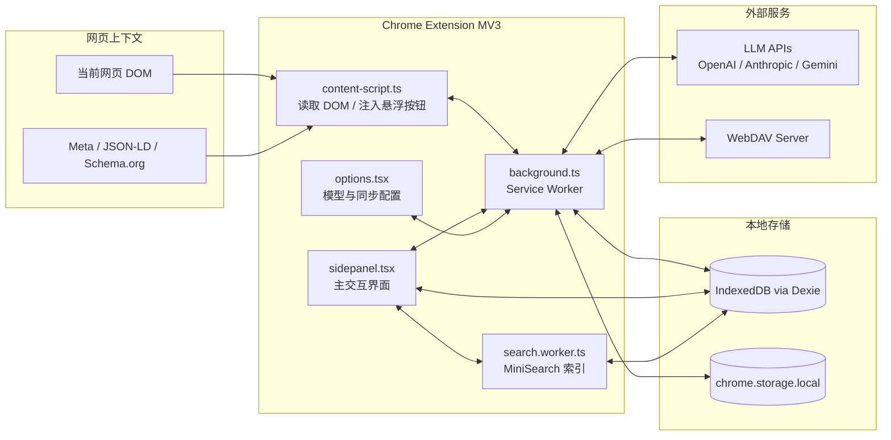

## 关键职责划分

- `content-script.ts`
  - 访问当前页面 DOM
  - 执行 Readability 解析
  - 提取 metadata
  - 触发捕获事件
  - 可注入悬浮按钮

- `background.ts`
  - MV3 Service Worker 调度中心
  - 负责跨上下文通信
  - 调用 LLM API
  - 执行 WebDAV 同步
  - 处理右键菜单、快捷键、side panel 打开

- `sidepanel.tsx`
  - Chat with Doc 主界面
  - 展示当前文档
  - 展示 AI 流式回复
  - 搜索入口
  - 时间轴入口

- `options.tsx`
  - 模型配置
  - API Key 管理
  - Base URL 配置
  - WebDAV 配置
  - 系统提示词配置

- `search.worker.ts`
  - MiniSearch 索引构建
  - 异步增量更新
  - 全文检索响应

---

# 3. 捕获层数据流

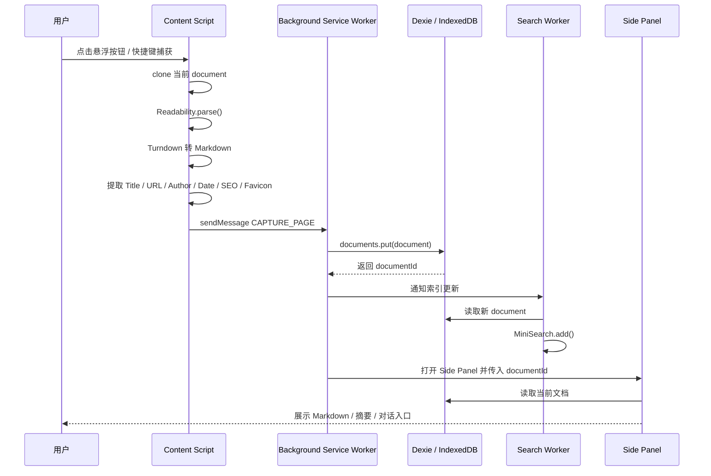

## 捕获结果结构

```ts
interface CapturedDocument {
  id: string;
  title: string;
  url: string;
  author?: string;
  publishedAt?: string;
  favicon?: string;
  description?: string;
  keywords?: string[];
  markdownContent: string;
  rawHtml?: string;
  siteName?: string;
  createdAt: number;
  updatedAt: number;
}
```

---

# 4. Thinking 层：多模型与流式对话架构

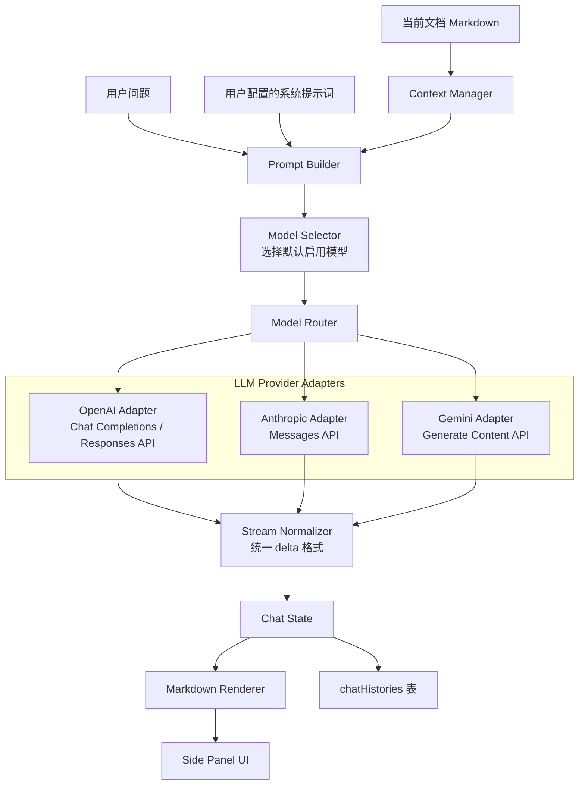

## 统一流式输出格式

不同模型的 SSE chunk 格式不一致，建议统一归一化：

```ts
interface StreamDelta {
  type: 'text' | 'reasoning' | 'tool' | 'done' | 'error';
  content?: string;
  error?: string;
}
```

## 模型配置结构

```ts
interface ModelProviderConfig {
  id: string;
  name: string;
  provider: 'openai' | 'anthropic' | 'gemini';
  enabled: boolean;
  apiKey: string;
  baseUrl?: string;
  model: string;
  systemPrompt?: string;
  createdAt: number;
  updatedAt: number;
}
```

---

# 5. Chat with Doc 流式对话时序图

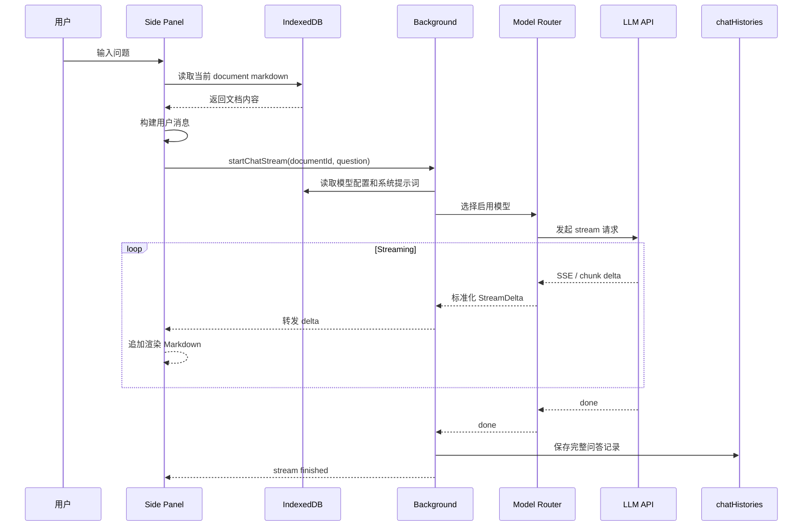

---

# 6. 记忆层：IndexedDB 数据模型

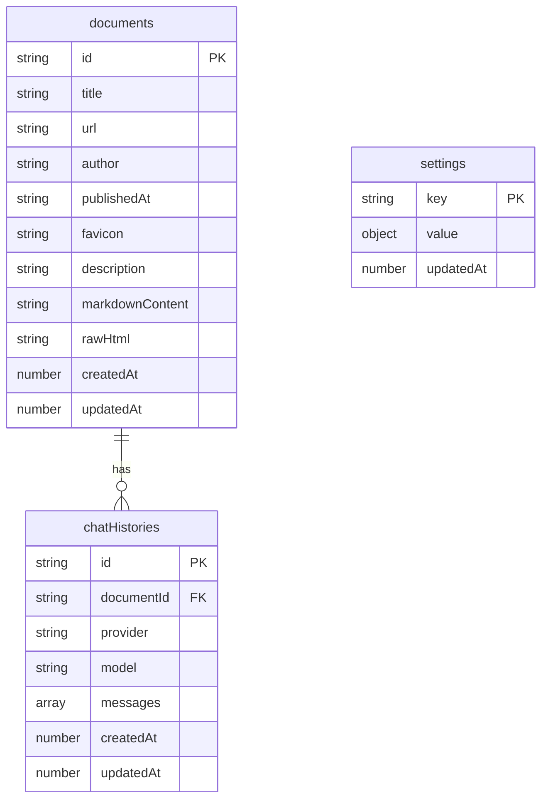

## Dexie 表建议

```ts
db.version(1).stores({
  documents: 'id, url, title, createdAt, updatedAt',
  chatHistories: 'id, documentId, createdAt, updatedAt',
  settings: 'key, updatedAt'
});
```

---

# 7. WebDAV 整包同步架构

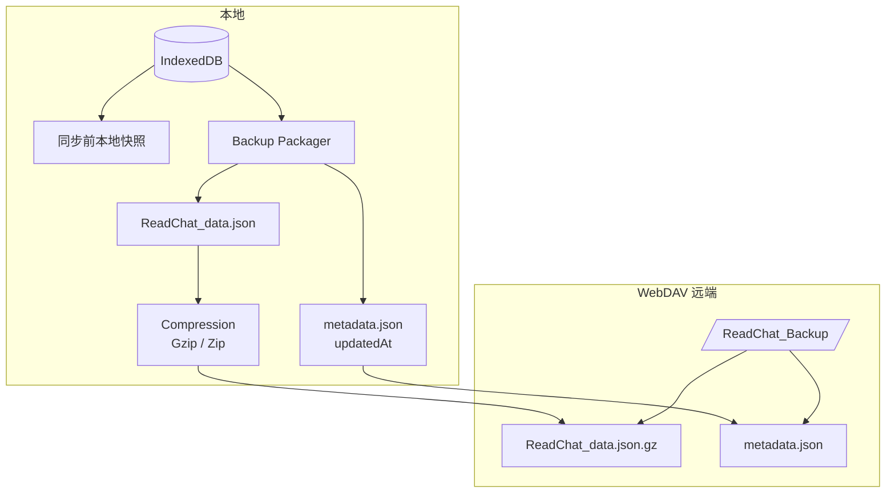

## 上传流程

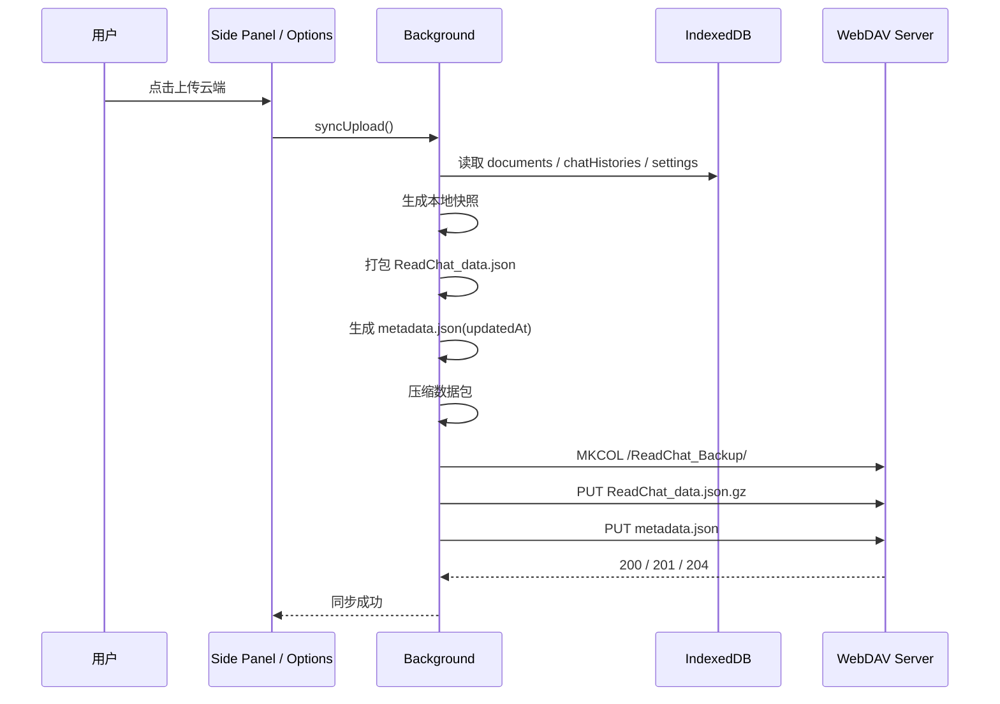

## 拉取流程

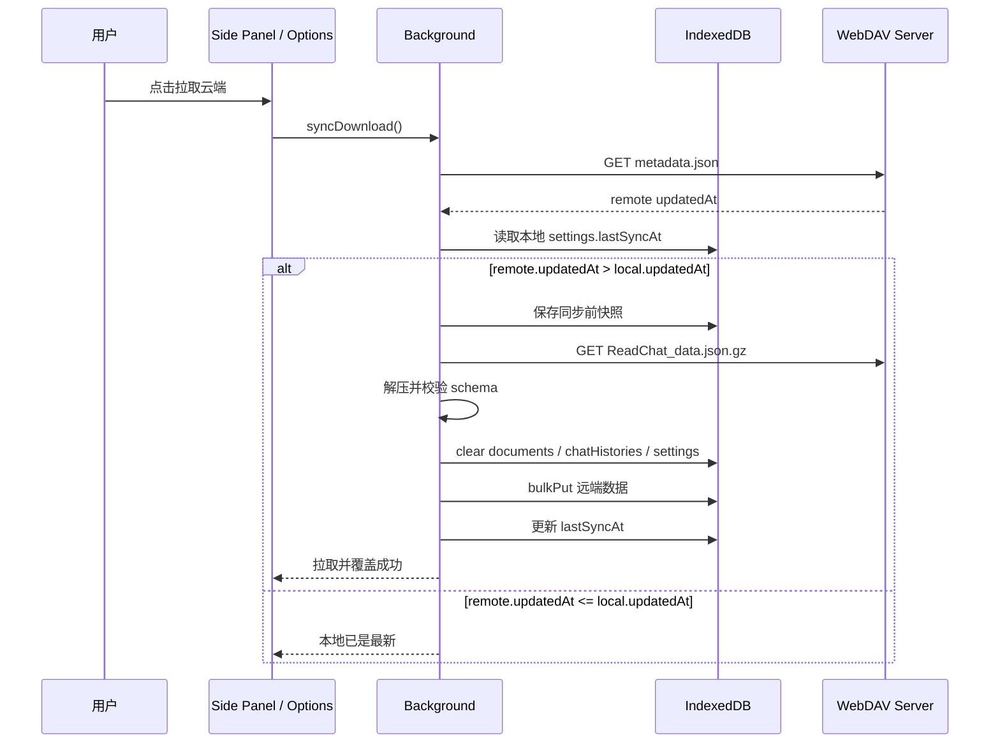

## 压缩说明

你写的是“JSZip 进行 Gzip 压缩”，这里建议稍微区分：

- 如果要生成 `.zip`：使用 `JSZip`
- 如果要生成 `.gz`：使用 `CompressionStream('gzip')` 或 `pako`
- 如果目标是“单文件整包备份”，两者都可以，推荐命名保持一致：
  - `ReadChat_data.json.gz`
  - 或 `ReadChat_backup.zip`

---

# 8. Awakening 层：MiniSearch 本地检索架构

```mermaid
flowchart TB
  Documents[(documents 表)] --> ChangeNotifier[Document Change Notifier]
  ChangeNotifier --> SearchWorker[search.worker.ts]

  SearchWorker --> LoadDocs[读取新增 / 更新文档]
  LoadDocs --> Normalize[文本清洗与字段标准化]
  Normalize --> MiniSearchIndex[MiniSearch Index]

  MiniSearchIndex --> SearchQuery[search(query)]
  SearchQuery --> Ranking[字段权重排序<br/>title x3<br/>markdownContent x1]
  Ranking --> SearchResult[SearchResult[]]

  SidePanel[Side Panel Search UI] --> SearchQuery
  SearchResult --> SidePanel
```

## Worker 消息协议

```ts
type SearchWorkerRequest =
  | { type: 'INIT_INDEX' }
  | { type: 'UPSERT_DOCUMENT'; documentId: string }
  | { type: 'REMOVE_DOCUMENT'; documentId: string }
  | { type: 'SEARCH'; query: string; requestId: string };

type SearchWorkerResponse =
  | { type: 'INDEX_READY' }
  | { type: 'SEARCH_RESULT'; requestId: string; results: SearchResult[] }
  | { type: 'ERROR'; message: string };
```

## MiniSearch 配置建议

```ts
const miniSearch = new MiniSearch({
  fields: ['title', 'markdownContent'],
  storeFields: ['id', 'title', 'url', 'createdAt'],
  searchOptions: {
    boost: {
      title: 3,
      markdownContent: 1
    },
    fuzzy: 0.2,
    prefix: true
  }
});
```

---

# 9. 时间轴 Timeline 架构

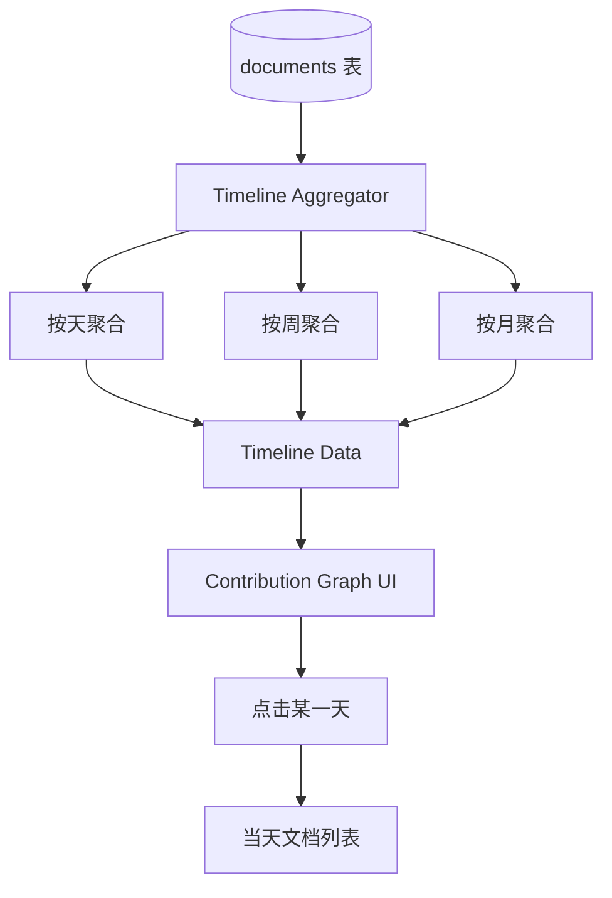

## 聚合结果结构

```ts
interface TimelineBucket {
  date: string;
  count: number;
  documentIds: string[];
}

interface TimelineQuery {
  mode: 'day' | 'week' | 'month';
  startAt: number;
  endAt: number;
}
```

---

# 10. 模块依赖关系图

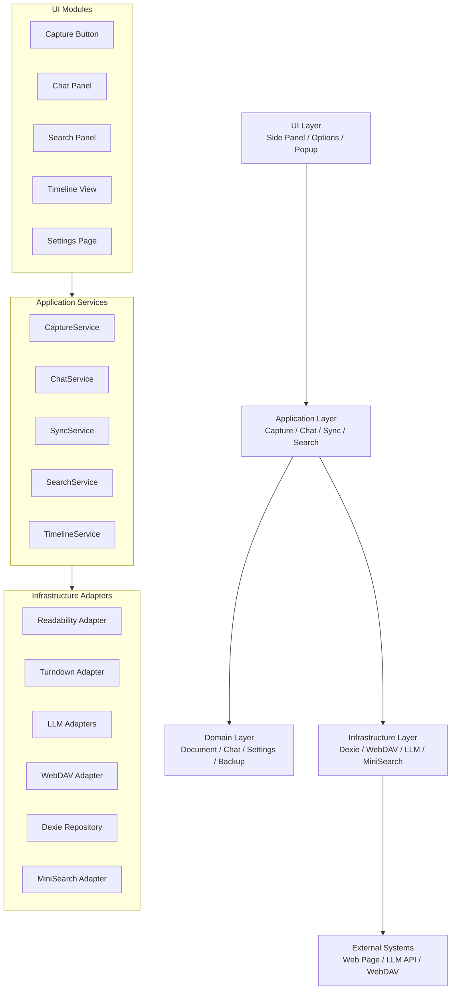

---

# 11. 推荐目录结构

```text
src/
  manifest.json

  background/
    index.ts
    message-router.ts
    commands.ts
    side-panel.ts

  content/
    index.ts
    floating-button.ts
    capture-page.ts
    metadata-extractor.ts

  sidepanel/
    App.tsx
    pages/
      ChatPage.tsx
      SearchPage.tsx
      TimelinePage.tsx
    components/
      MarkdownRenderer.tsx
      ChatInput.tsx
      StreamMessage.tsx

  options/
    App.tsx
    ModelSettings.tsx
    WebDAVSettings.tsx
    PromptSettings.tsx

  workers/
    search.worker.ts

  core/
    documents/
      document.types.ts
      document.service.ts
      document.repository.ts
    chat/
      chat.types.ts
      chat.service.ts
      prompt-builder.ts
    models/
      model.types.ts
      model-router.ts
      adapters/
        openai.adapter.ts
        anthropic.adapter.ts
        gemini.adapter.ts
    sync/
      sync.types.ts
      backup-packager.ts
      webdav-client.ts
      sync.service.ts
    search/
      search.types.ts
      search.client.ts
    timeline/
      timeline.service.ts

  db/
    dexie.ts
    schema.ts
    migrations.ts

  shared/
    messaging/
      messages.ts
      runtime-client.ts
    crypto/
      secret-store.ts
    utils/
      time.ts
      id.ts
      json.ts
```

---

# 12. 核心端到端流程

## 捕获并 AI 消化文章

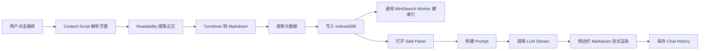

## WebDAV 冷同步

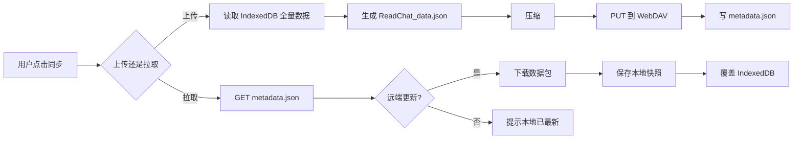

---

# 13. 关键设计原则

- **Local-First**：documents、chatHistories、settings 都以 IndexedDB 为主存储。
- **Extension-First**：捕获、对话、搜索都在扩展内闭环完成。
- **Adapter-Based LLM**：不同模型供应商只实现 adapter，UI 和 ChatService 不感知供应商差异。
- **Cold Sync Only**：WebDAV 使用整包覆盖，避免复杂增量合并。
- **Worker-Based Search**：MiniSearch 索引构建放入 Worker，避免阻塞侧边栏 UI。
- **Schema-Versioned Backup**：备份文件需要带 `schemaVersion`，方便未来迁移。

---
